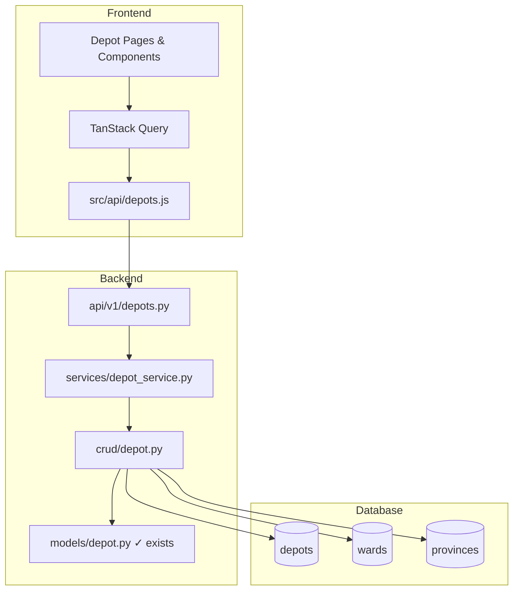
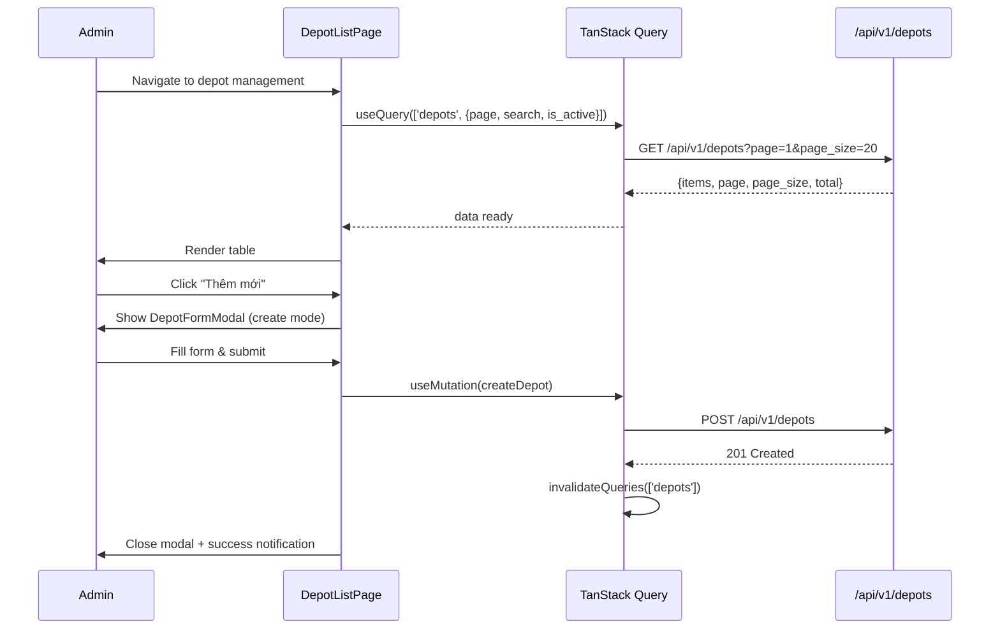

# Design Document — Depot Management (UC-WEB-07)

## Overview

Chức năng CRUD quản lý depot (trung tâm/chi nhánh/bưu cục) cho hệ thống VeloxShip. Feature sử dụng bảng `depots` hiện có mà **không thay đổi schema**, cung cấp REST API tại `/api/v1/depots` và giao diện React tại `src/features/depots/`.

### Scope

- List depots (paginated, searchable, filterable)
- Create depot
- Update depot (partial update, code immutable)
- Activate / Deactivate depot (soft toggle via `is_active`)
- Frontend CRUD UI with cascading ward selection

### Design Decisions

| Decision | Rationale |
|---|---|
| Reuse existing `depots` table as-is | No schema changes allowed per constraint |
| Ward model has `province_code` (no district) | Match actual code — Ward → Province directly |
| Use `unaccent` extension for search | PostgreSQL built-in, diacritics-insensitive search for Vietnamese |
| PATCH for both update and activate/deactivate | Single endpoint, partial update semantics |
| Cascading select: Province → Ward (skip district) | Ward model links to Province directly, no District model exists |

---

## Architecture



**Layer responsibilities (per conventions.md §2.2):**

| Layer | Responsibility |
|---|---|
| `api/v1/depots.py` | HTTP routing, query params, status codes, auth dependency |
| `services/depot_service.py` | Validate ward_code exists, check duplicate code, business rules |
| `crud/depot.py` | SQL queries, joins, pagination, unaccent search |
| `models/depot.py` | Already exists — no changes |

---

## Components and Interfaces

### Backend API Endpoints

#### `GET /api/v1/depots`

List depots with pagination, search, and filter.

**Query Parameters:**

| Param | Type | Default | Constraints |
|---|---|---|---|
| `page` | int | 1 | >= 1 |
| `page_size` | int | 20 | 1–100 |
| `search` | string | null | 1–100 chars, diacritics-insensitive |
| `is_active` | bool | null | filter by active status |

**Response (200):**

```json
{
  "items": [
    {
      "id": 1,
      "code": "HCM01",
      "name": "Bưu cục Quận 1",
      "phone": "0901234567",
      "address_detail": "123 Nguyễn Huệ, P. Bến Nghé",
      "ward_code": "26734",
      "ward_name": "Phường Bến Nghé",
      "province_code": "79",
      "province_name": "TP. Hồ Chí Minh",
      "is_active": true,
      "created_at": "2024-01-15T10:00:00Z",
      "updated_at": "2024-01-15T10:00:00Z"
    }
  ],
  "page": 1,
  "page_size": 20,
  "total": 42
}
```

> **Note on Ward → Province resolution:** Since Ward model links directly to Province (no District model exists), the response includes `ward_name` and `province_name` only. District information is not available in the current schema.

#### `POST /api/v1/depots`

Create a new depot.

**Request Body:**

```json
{
  "code": "HCM02",
  "name": "Bưu cục Quận 2",
  "phone": "0901234568",
  "address_detail": "456 Đường ABC, P. Thảo Điền",
  "ward_code": "26890"
}
```

**Validation Rules:**

| Field | Rule |
|---|---|
| `code` | Required, uppercase alphanumeric `[A-Z0-9]`, 3–20 chars |
| `name` | Required, 1–255 chars |
| `phone` | Required, 10 digits starting with `0` (regex: `^0\d{9}$`) |
| `address_detail` | Required, 1–500 chars |
| `ward_code` | Optional, must exist in `wards` table if provided |

**Response (201):** Created depot record (same shape as list item).

**Errors:**
- `409 DEPOT_CODE_EXISTS` — code already taken
- `422 WARD_NOT_FOUND` — ward_code invalid

#### `PATCH /api/v1/depots/{id}`

Update depot fields (partial). Code is immutable — ignored if sent.

**Request Body (all fields optional):**

```json
{
  "name": "Bưu cục Quận 2 - Cập nhật",
  "phone": "0909876543",
  "address_detail": "789 Đường XYZ",
  "ward_code": "26891",
  "is_active": false
}
```

**Response (200):** Updated depot record.

**Errors:**
- `404 DEPOT_NOT_FOUND` — id doesn't exist
- `422 WARD_NOT_FOUND` — ward_code invalid

**Idempotency:** If `is_active` matches current value, return record without updating `updated_at`.

---

### Backend Layer Breakdown

#### Schemas (`app/schemas/depot.py`)

```python
class DepotCreate(BaseModel):
    code: str                    # validated: ^[A-Z0-9]{3,20}$
    name: str                    # validated: 1-255 chars
    phone: str                   # validated: ^0\d{9}$
    address_detail: str          # validated: 1-500 chars
    ward_code: str | None = None

class DepotUpdate(BaseModel):
    name: str | None = None
    phone: str | None = None
    address_detail: str | None = None
    ward_code: str | None = None
    is_active: bool | None = None

class DepotRead(BaseModel):
    id: int
    code: str
    name: str
    phone: str
    address_detail: str
    ward_code: str | None
    ward_name: str | None
    province_code: str | None
    province_name: str | None
    is_active: bool
    created_at: datetime
    updated_at: datetime

class DepotPage(Page[DepotRead]):
    pass  # inherits items, page, page_size, total from common.Page
```

#### CRUD (`app/crud/depot.py`)

Key functions:

```python
async def list_depots(
    db: AsyncSession,
    *,
    page: int = 1,
    page_size: int = 20,
    search: str | None = None,
    is_active: bool | None = None,
) -> tuple[list[Depot], int]: ...

async def get_depot(db: AsyncSession, depot_id: int) -> Depot | None: ...

async def get_depot_by_code(db: AsyncSession, code: str) -> Depot | None: ...

async def create_depot(db: AsyncSession, *, payload: DepotCreate) -> Depot: ...

async def update_depot(db: AsyncSession, *, depot: Depot, payload: DepotUpdate) -> Depot: ...
```

**Search implementation:**

```sql
-- Diacritics-insensitive search using unaccent extension
WHERE unaccent(lower(depots.name)) LIKE '%' || unaccent(lower(:search)) || '%'
   OR unaccent(lower(depots.code)) LIKE '%' || unaccent(lower(:search)) || '%'
```

#### Service (`app/services/depot_service.py`)

```python
async def create_depot(db: AsyncSession, payload: DepotCreate) -> Depot:
    # 1. Check code uniqueness → ConflictError
    # 2. Validate ward_code exists if provided → ValidationError
    # 3. Delegate to crud.create_depot

async def update_depot(db: AsyncSession, depot_id: int, payload: DepotUpdate) -> Depot:
    # 1. Get depot → NotFoundError if missing
    # 2. Validate ward_code if provided → ValidationError
    # 3. Handle is_active idempotency check
    # 4. Delegate to crud.update_depot
```

---

### Frontend Component Tree

```
src/features/depots/
├── pages/
│   └── DepotListPage.jsx          # Main page with table + search + filter
├── components/
│   ├── DepotTable.jsx             # Ant Design Table with columns
│   ├── DepotFormModal.jsx         # Create/Edit modal form
│   ├── DepotSearchBar.jsx         # Search input with debounce
│   └── DepotStatusBadge.jsx       # Active/Inactive badge
└── schema.js                      # Zod validation schema
```

**Additional files:**

```
src/api/depots.js                  # API functions (getDepots, createDepot, updateDepot)
src/i18n/vi.js                     # Vietnamese strings (depot section added)
```

#### Data Flow



---

## Data Models

No new models or schema changes. Reusing existing:

| Model | Table | Status |
|---|---|---|
| `Depot` | `depots` | Exists — no changes |
| `Ward` | `wards` | Exists — has `province_code` FK |
| `Province` | `provinces` | Exists — used for name resolution |

### Relationships for Query

```
Depot.ward_code → Ward.code → Ward.province_code → Province.code
```

The CRUD layer joins these for name resolution in list/read responses.

---

## Correctness Properties

*A property is a characteristic or behavior that should hold true across all valid executions of a system — essentially, a formal statement about what the system should do. Properties serve as the bridge between human-readable specifications and machine-verifiable correctness guarantees.*

### Property 1: Diacritics-insensitive search equivalence

*For any* depot name containing Vietnamese diacritics and *for any* search query that is the unaccented equivalent of part of that name, the search SHALL return that depot in the results.

**Validates: Requirements 1.2**

### Property 2: Filter AND composition

*For any* combination of search keyword and is_active filter applied simultaneously, every depot in the result set SHALL satisfy ALL applied filter conditions (matching search AND matching is_active value).

**Validates: Requirements 1.3, 1.7**

### Property 3: Pagination slice correctness

*For any* dataset of depots and *for any* valid page/page_size parameters, the returned items SHALL equal the correct slice of the sorted dataset (offset = (page-1) * page_size, limit = page_size), and the total count SHALL equal the full filtered dataset size.

**Validates: Requirements 1.4**

### Property 4: Input validation boundary correctness

*For any* string input for the code field, it SHALL be accepted if and only if it matches `^[A-Z0-9]{3,20}$`. *For any* string input for the phone field, it SHALL be accepted if and only if it matches `^0\d{9}$`. *For any* string input for name, it SHALL be accepted if and only if its length is between 1 and 255 inclusive. *For any* string input for address_detail, it SHALL be accepted if and only if its length is between 1 and 500 inclusive.

**Validates: Requirements 2.4, 2.5, 2.6, 3.4**

### Property 5: Partial update field preservation

*For any* existing depot and *for any* subset of updatable fields provided in a PATCH request, only the provided fields SHALL change in the persisted record; all other fields SHALL retain their previous values.

**Validates: Requirements 3.1**

### Property 6: Idempotent status toggle

*For any* depot, if a PATCH request sets `is_active` to the depot's current `is_active` value, the `updated_at` timestamp SHALL remain unchanged.

**Validates: Requirements 4.3**

### Property 7: Inactive depot exclusion from selection

*For any* set of depots where some have `is_active = false`, operational selection queries (for bill creation, vehicle assignment) SHALL never include inactive depots in their results.

**Validates: Requirements 4.4**

---

## Error Handling

All errors use `AppError` subclasses (per conventions.md §6.1):

| Scenario | Error Class | error_code | message (Vietnamese) | HTTP |
|---|---|---|---|---|
| Depot not found | `NotFoundError` | `DEPOT_NOT_FOUND` | Không tìm thấy bưu cục | 404 |
| Duplicate code | `ConflictError` | `DEPOT_CODE_EXISTS` | Mã bưu cục đã tồn tại | 409 |
| Invalid ward_code | `AppError` | `WARD_NOT_FOUND` | Mã phường/xã không hợp lệ | 422 |
| Validation failure | FastAPI default | — | Field-level errors | 422 |

**Frontend error handling:**
- API errors display via Ant Design `message.error()` using the `message` field from response
- Form stays open on error, preserving user input
- Network errors show generic "Lỗi kết nối, vui lòng thử lại"

---

## Testing Strategy

### Unit Tests (Backend)

| Test | What it verifies |
|---|---|
| Schema validation tests | Code regex, phone regex, length constraints |
| Service: duplicate code detection | ConflictError raised |
| Service: ward_code validation | Error when ward doesn't exist |
| Service: idempotent is_active | updated_at unchanged |
| CRUD: search with unaccent | Diacritics-insensitive matching |
| CRUD: pagination math | Correct offset/limit |

### Property-Based Tests (Backend — pytest + Hypothesis)

Each property test runs minimum **100 iterations** with generated inputs.

| Property | Generator Strategy |
|---|---|
| Property 1: Diacritics search | Generate Vietnamese strings with random diacritics, strip diacritics for query |
| Property 2: Filter AND | Generate depot lists with mixed attributes, apply random filter combos |
| Property 3: Pagination | Generate dataset sizes + random page/page_size, verify slice |
| Property 4: Validation | Generate random strings, verify acceptance iff matching rules |
| Property 5: Partial update | Generate random subsets of fields, verify only those change |
| Property 6: Idempotent toggle | Generate depots with random is_active, set same value |
| Property 7: Inactive exclusion | Generate mixed active/inactive sets, verify selection filtering |

**Tag format:** `# Feature: depot-management, Property {N}: {title}`

**Library:** `hypothesis` (Python) for backend property tests.

### Integration Tests (Backend)

- Full endpoint flow: create → list → update → deactivate
- Join resolution: ward/province names appear correctly
- Search across accented/unaccented variants

### Frontend Tests

- Component rendering: table columns, modal fields, badge display
- Form validation: zod schema rejects invalid inputs with Vietnamese messages
- Interaction: debounced search, modal open/close, mutation success/error flows
- Testing library: Vitest + React Testing Library

### What is NOT property-tested

- UI rendering and layout (use component tests)
- Database join resolution (integration test)
- Auth/permission checks (example-based)
- Network error handling (mock-based)
