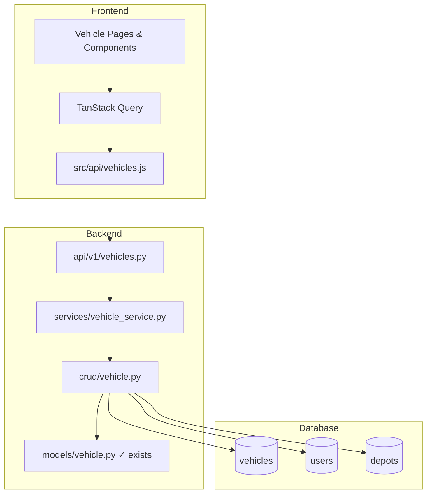
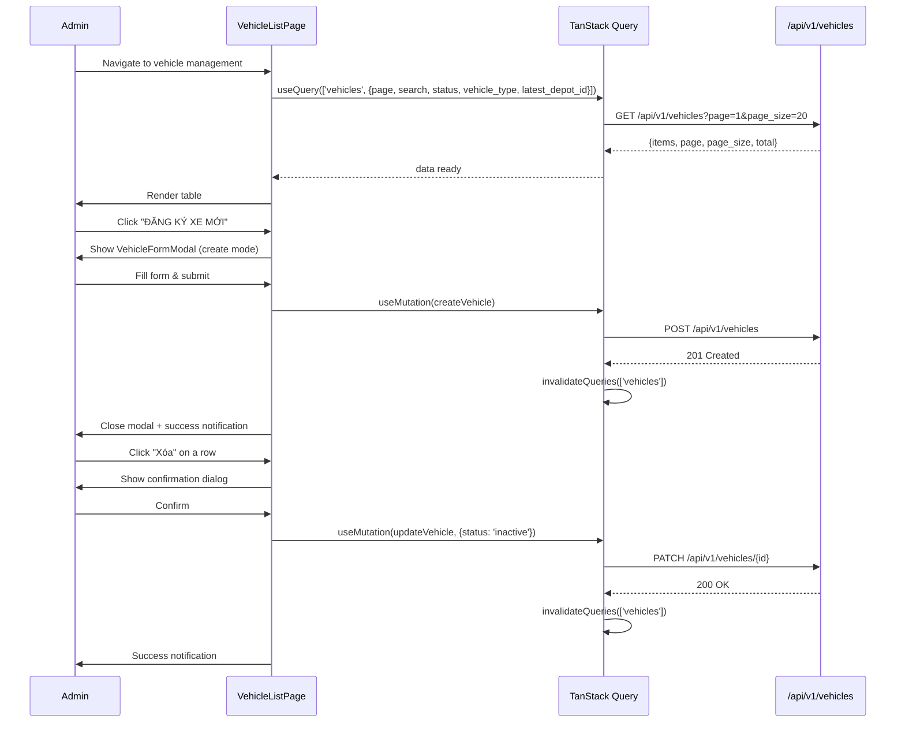

# Design Document — Vehicles Management (Quản lý Đội xe)

## Overview

Chức năng CRUD quản lý đội xe vận chuyển cho hệ thống VeloxShip. Feature sử dụng bảng `vehicles` hiện có mà **không thay đổi schema**, cung cấp REST API tại `/api/v1/vehicles` và giao diện React tại `src/features/vehicles/`.

### Scope

- List vehicles (paginated, searchable by license_plate, filterable by status/vehicle_type/depot)
- Create vehicle (with driver/depot validation)
- Update vehicle (partial update)
- Soft-delete via PATCH status='inactive'
- Frontend CRUD UI with table, modal forms, filters

### Design Decisions

| Decision | Rationale |
|---|---|
| Reuse existing `vehicles` table as-is | No schema changes allowed per constraint |
| Join users/depots in CRUD layer for name resolution | Driver name and depot name needed in list/read responses |
| `latest_linehaul_id` NOT exposed in vehicle CRUD | Managed by linehaul module, not vehicle management |
| Use `Decimal` for max_weight_kg and max_volume_m3 | Per conventions.md §5.2 — no float for numeric precision |
| PATCH for both update and soft-delete | Single endpoint, partial update semantics (same as depot pattern) |
| Search only on license_plate (case-insensitive) | Primary identifier for vehicles, no diacritics needed |

---

## Architecture



**Layer responsibilities (per conventions.md §2.2):**

| Layer | Responsibility |
|---|---|
| `api/v1/vehicles.py` | HTTP routing, query params, status codes, auth dependency |
| `services/vehicle_service.py` | Validate license_plate uniqueness, driver_id exists & active, latest_depot_id exists, idempotent status toggle |
| `crud/vehicle.py` | SQL queries, joins (users for driver_name, depots for depot_name), pagination, search |
| `models/vehicle.py` | Already exists — no changes |

---

## Components and Interfaces

### Backend API Endpoints

#### `GET /api/v1/vehicles`

List vehicles with pagination, search, and filters.

**Query Parameters:**

| Param | Type | Default | Constraints |
|---|---|---|---|
| `page` | int | 1 | >= 1 |
| `page_size` | int | 20 | 1–100 |
| `search` | string | null | 1–100 chars, filters by license_plate (case-insensitive) |
| `status` | string | null | one of: active, inactive, maintenance |
| `vehicle_type` | string | null | one of: motorcycle, truck |
| `latest_depot_id` | int | null | filter by depot assignment |

**Response (200):**

```json
{
  "items": [
    {
      "id": 1,
      "license_plate": "51C-12345",
      "vehicle_type": "truck",
      "max_weight_kg": "5000.000",
      "max_volume_m3": "20.50",
      "driver_id": 3,
      "driver_name": "Nguyễn Văn A",
      "latest_depot_id": 1,
      "depot_name": "Bưu cục Quận 1",
      "status": "active",
      "created_at": "2024-01-15T10:00:00Z",
      "updated_at": "2024-01-15T10:00:00Z"
    }
  ],
  "page": 1,
  "page_size": 20,
  "total": 15
}
```

#### `POST /api/v1/vehicles`

Create a new vehicle.

**Request Body:**

```json
{
  "license_plate": "51C-12345",
  "vehicle_type": "truck",
  "max_weight_kg": "5000.000",
  "max_volume_m3": "20.50",
  "latest_depot_id": 1,
  "driver_id": 3,
  "status": "active"
}
```

**Validation Rules:**

| Field | Rule |
|---|---|
| `license_plate` | Required, non-empty string |
| `vehicle_type` | Required, one of: `motorcycle`, `truck` |
| `max_weight_kg` | Required, positive Decimal, max Numeric(12,3) |
| `max_volume_m3` | Required, positive Decimal, max Numeric(8,2) |
| `latest_depot_id` | Optional, must exist in `depots` table if provided |
| `driver_id` | Optional, must reference an active user in `users` table if provided |
| `status` | Optional, one of: `active`, `inactive`, `maintenance`. Defaults to `active` |

**Response (201):** Created vehicle record (same shape as list item).

**Errors:**
- `409 VEHICLE_LICENSE_PLATE_EXISTS` — Biển số xe đã tồn tại trong hệ thống
- `422 DRIVER_NOT_FOUND` — Tài xế không tồn tại hoặc không hoạt động
- `422 DEPOT_NOT_FOUND` — Bưu cục không tồn tại

#### `PATCH /api/v1/vehicles/{id}`

Update vehicle fields (partial). Also used for soft-delete (set status='inactive').

**Request Body (all fields optional):**

```json
{
  "license_plate": "51C-99999",
  "vehicle_type": "motorcycle",
  "max_weight_kg": "200.000",
  "max_volume_m3": "1.50",
  "latest_depot_id": 2,
  "driver_id": 5,
  "status": "inactive"
}
```

**Response (200):** Updated vehicle record.

**Errors:**
- `404 VEHICLE_NOT_FOUND` — Không tìm thấy phương tiện
- `409 VEHICLE_LICENSE_PLATE_EXISTS` — Biển số xe đã tồn tại trong hệ thống
- `422 DRIVER_NOT_FOUND` — Tài xế không tồn tại hoặc không hoạt động
- `422 DEPOT_NOT_FOUND` — Bưu cục không tồn tại

**Idempotency:** If `status` matches current value and no other fields are provided, return record without updating `updated_at`.

---

### Backend Layer Breakdown

#### Schemas (`app/schemas/vehicle.py`)

```python
from decimal import Decimal
from datetime import datetime
from pydantic import BaseModel, field_validator
from app.schemas.common import Page


class VehicleCreate(BaseModel):
    """Schema for creating a new vehicle."""

    license_plate: str
    vehicle_type: str
    max_weight_kg: Decimal
    max_volume_m3: Decimal
    latest_depot_id: int | None = None
    driver_id: int | None = None
    status: str | None = None  # defaults to "active" in service

    @field_validator("license_plate")
    @classmethod
    def validate_license_plate(cls, v: str) -> str:
        if not v or not v.strip():
            raise ValueError("Biển số xe không được để trống")
        return v.strip()

    @field_validator("vehicle_type")
    @classmethod
    def validate_vehicle_type(cls, v: str) -> str:
        if v not in ("motorcycle", "truck"):
            raise ValueError("Loại xe phải là 'motorcycle' hoặc 'truck'")
        return v

    @field_validator("max_weight_kg")
    @classmethod
    def validate_max_weight_kg(cls, v: Decimal) -> Decimal:
        if v <= 0:
            raise ValueError("Tải trọng phải là số dương")
        return v

    @field_validator("max_volume_m3")
    @classmethod
    def validate_max_volume_m3(cls, v: Decimal) -> Decimal:
        if v <= 0:
            raise ValueError("Thể tích phải là số dương")
        return v

    @field_validator("status")
    @classmethod
    def validate_status(cls, v: str | None) -> str | None:
        if v is not None and v not in ("active", "inactive", "maintenance"):
            raise ValueError("Trạng thái phải là 'active', 'inactive', hoặc 'maintenance'")
        return v


class VehicleUpdate(BaseModel):
    """Schema for partial vehicle update."""

    license_plate: str | None = None
    vehicle_type: str | None = None
    max_weight_kg: Decimal | None = None
    max_volume_m3: Decimal | None = None
    latest_depot_id: int | None = None
    driver_id: int | None = None
    status: str | None = None

    @field_validator("license_plate")
    @classmethod
    def validate_license_plate(cls, v: str | None) -> str | None:
        if v is not None and (not v or not v.strip()):
            raise ValueError("Biển số xe không được để trống")
        return v.strip() if v else v

    @field_validator("vehicle_type")
    @classmethod
    def validate_vehicle_type(cls, v: str | None) -> str | None:
        if v is not None and v not in ("motorcycle", "truck"):
            raise ValueError("Loại xe phải là 'motorcycle' hoặc 'truck'")
        return v

    @field_validator("max_weight_kg")
    @classmethod
    def validate_max_weight_kg(cls, v: Decimal | None) -> Decimal | None:
        if v is not None and v <= 0:
            raise ValueError("Tải trọng phải là số dương")
        return v

    @field_validator("max_volume_m3")
    @classmethod
    def validate_max_volume_m3(cls, v: Decimal | None) -> Decimal | None:
        if v is not None and v <= 0:
            raise ValueError("Thể tích phải là số dương")
        return v

    @field_validator("status")
    @classmethod
    def validate_status(cls, v: str | None) -> str | None:
        if v is not None and v not in ("active", "inactive", "maintenance"):
            raise ValueError("Trạng thái phải là 'active', 'inactive', hoặc 'maintenance'")
        return v


class VehicleRead(BaseModel):
    """Schema for vehicle response."""

    id: int
    license_plate: str
    vehicle_type: str
    max_weight_kg: Decimal
    max_volume_m3: Decimal
    driver_id: int | None
    driver_name: str | None
    latest_depot_id: int | None
    depot_name: str | None
    status: str
    created_at: datetime
    updated_at: datetime

    model_config = {"from_attributes": True}


class VehiclePage(Page[VehicleRead]):
    """Paginated vehicle list response."""

    pass
```

#### CRUD (`app/crud/vehicle.py`)

Key functions:

```python
async def list_vehicles(
    db: AsyncSession,
    *,
    page: int = 1,
    page_size: int = 20,
    search: str | None = None,
    status: str | None = None,
    vehicle_type: str | None = None,
    latest_depot_id: int | None = None,
) -> tuple[list[Vehicle], int]: ...

async def get_vehicle(db: AsyncSession, vehicle_id: int) -> Vehicle | None: ...

async def get_vehicle_by_license_plate(db: AsyncSession, license_plate: str) -> Vehicle | None: ...

async def create_vehicle(db: AsyncSession, *, payload: VehicleCreate) -> Vehicle: ...

async def update_vehicle(db: AsyncSession, *, vehicle: Vehicle, payload: VehicleUpdate) -> Vehicle: ...
```

**Search implementation:**

```sql
-- Case-insensitive search on license_plate
WHERE lower(vehicles.license_plate) LIKE '%' || lower(:search) || '%'
```

**Join resolution (private helper):**

```python
async def _load_driver_depot(db: AsyncSession, vehicles: list[Vehicle]) -> None:
    """Attach driver_name and depot_name as transient attributes."""
    # Batch-load driver names from users table
    driver_ids = [v.driver_id for v in vehicles if v.driver_id]
    # Batch-load depot names from depots table
    depot_ids = [v.latest_depot_id for v in vehicles if v.latest_depot_id]
    # Set driver_name and depot_name on each vehicle instance
```

#### Service (`app/services/vehicle_service.py`)

```python
async def create_vehicle(db: AsyncSession, payload: VehicleCreate) -> Vehicle:
    # 1. Check license_plate uniqueness → ConflictError
    # 2. Validate driver_id exists & is active if provided → AppError(DRIVER_NOT_FOUND)
    # 3. Validate latest_depot_id exists if provided → AppError(DEPOT_NOT_FOUND)
    # 4. Set default status='active' if not provided
    # 5. Delegate to crud.create_vehicle

async def update_vehicle(db: AsyncSession, vehicle_id: int, payload: VehicleUpdate) -> Vehicle:
    # 1. Get vehicle → NotFoundError if missing
    # 2. Check license_plate uniqueness (exclude self) if provided → ConflictError
    # 3. Validate driver_id if provided → AppError(DRIVER_NOT_FOUND)
    # 4. Validate latest_depot_id if provided → AppError(DEPOT_NOT_FOUND)
    # 5. Handle status idempotency check
    # 6. Delegate to crud.update_vehicle
```

**Validation helpers:**

```python
async def _validate_driver(db: AsyncSession, driver_id: int) -> None:
    """Raise AppError(DRIVER_NOT_FOUND) if user doesn't exist or is not active."""
    result = await db.execute(
        select(User.id).where(User.id == driver_id, User.is_active == True)
    )
    if result.scalar_one_or_none() is None:
        raise AppError("DRIVER_NOT_FOUND", status_code=422)


async def _validate_depot(db: AsyncSession, depot_id: int) -> None:
    """Raise AppError(DEPOT_NOT_FOUND) if depot doesn't exist."""
    result = await db.execute(select(Depot.id).where(Depot.id == depot_id))
    if result.scalar_one_or_none() is None:
        raise AppError("DEPOT_NOT_FOUND", status_code=422)
```

---

### Frontend Component Tree

```
src/features/vehicles/
├── pages/
│   └── VehicleListPage.jsx        # Main page with table + search + filters
├── components/
│   ├── VehicleTable.jsx           # Ant Design Table with columns
│   ├── VehicleFormModal.jsx       # Create/Edit modal form
│   ├── VehicleSearchBar.jsx       # Search input with 300ms debounce
│   ├── VehicleFilters.jsx         # Status + vehicle_type filter dropdowns
│   └── VehicleStatusBadge.jsx     # Active/Inactive/Maintenance badge
└── schema.js                      # Zod validation schema
```

**Additional files:**

```
src/api/vehicles.js                # API functions (getVehicles, createVehicle, updateVehicle)
src/i18n/vi.js                     # Vietnamese strings (vehicle section added)
```

#### Data Flow



---

## Data Models

No new models or schema changes. Reusing existing:

| Model | Table | Status |
|---|---|---|
| `Vehicle` | `vehicles` | Exists — no changes |
| `User` | `users` | Exists — joined for driver_name resolution |
| `Depot` | `depots` | Exists — joined for depot_name resolution |

### Relationships for Query

```
Vehicle.driver_id → User.id → User.full_name (driver_name)
Vehicle.latest_depot_id → Depot.id → Depot.name (depot_name)
```

The CRUD layer joins these for name resolution in list/read responses.

### Field Types

| Field | DB Type | Python Type | Notes |
|---|---|---|---|
| `max_weight_kg` | `Numeric(12,3)` | `Decimal` | Per conventions — no float |
| `max_volume_m3` | `Numeric(8,2)` | `Decimal` | Per conventions — no float |
| `vehicle_type` | `String` | `str` | CHECK constraint: motorcycle, truck |
| `status` | `String` | `str` | CHECK constraint: active, inactive, maintenance |
| `latest_linehaul_id` | `ForeignKey` | `int | None` | NOT exposed in vehicle CRUD |

---

## Correctness Properties

*A property is a characteristic or behavior that should hold true across all valid executions of a system — essentially, a formal statement about what the system should do. Properties serve as the bridge between human-readable specifications and machine-verifiable correctness guarantees.*

### Property 1: Search filter correctness

*For any* set of vehicles and *for any* search string, every vehicle in the result set SHALL have a license_plate that contains the search string (case-insensitive), and no vehicle whose license_plate contains the search string shall be excluded from the result set.

**Validates: Requirements 1.2**

### Property 2: Filter AND composition

*For any* combination of status, vehicle_type, and latest_depot_id filters applied simultaneously, every vehicle in the result set SHALL satisfy ALL applied filter conditions (matching status AND matching vehicle_type AND matching latest_depot_id).

**Validates: Requirements 1.3, 1.4, 1.5, 1.9**

### Property 3: Pagination slice correctness

*For any* dataset of vehicles and *for any* valid page/page_size parameters, the returned items SHALL equal the correct slice of the sorted dataset (offset = (page-1) * page_size, limit = page_size), and the total count SHALL equal the full filtered dataset size.

**Validates: Requirements 1.6**

### Property 4: Input validation boundary correctness

*For any* string input for vehicle_type, it SHALL be accepted if and only if it is one of `motorcycle` or `truck`. *For any* Decimal input for max_weight_kg, it SHALL be accepted if and only if it is positive. *For any* Decimal input for max_volume_m3, it SHALL be accepted if and only if it is positive. *For any* string input for license_plate, it SHALL be rejected if and only if it is empty or contains only whitespace.

**Validates: Requirements 2.4, 2.5, 2.6, 2.7, 3.4**

### Property 5: License plate uniqueness

*For any* license_plate value that already exists on a vehicle in the system, attempting to create a new vehicle with that same license_plate OR updating a different vehicle to use that license_plate SHALL result in a ConflictError with error_code "VEHICLE_LICENSE_PLATE_EXISTS".

**Validates: Requirements 2.8, 3.5**

### Property 6: Foreign key reference validation

*For any* driver_id that does not reference an existing active user, creating or updating a vehicle with that driver_id SHALL fail with error_code "DRIVER_NOT_FOUND". *For any* latest_depot_id that does not reference an existing depot, creating or updating a vehicle with that depot_id SHALL fail with error_code "DEPOT_NOT_FOUND".

**Validates: Requirements 2.9, 2.10, 3.6, 3.7**

### Property 7: Partial update field preservation

*For any* existing vehicle and *for any* subset of updatable fields provided in a PATCH request, only the provided fields SHALL change in the persisted record; all other fields SHALL retain their previous values.

**Validates: Requirements 3.1**

### Property 8: Idempotent status toggle

*For any* vehicle, if a PATCH request sets `status` to the vehicle's current `status` value and provides no other fields, the `updated_at` timestamp SHALL remain unchanged and the response SHALL return the current record unmodified.

**Validates: Requirements 4.3**

### Property 9: Create round-trip

*For any* valid vehicle creation payload, after successful creation, reading the vehicle back SHALL return all submitted field values unchanged (license_plate, vehicle_type, max_weight_kg, max_volume_m3, driver_id, latest_depot_id).

**Validates: Requirements 2.1, 2.11**

---

## Error Handling

All errors use `AppError` subclasses (per conventions.md §6.1):

| Scenario | Error Class | error_code | message (Vietnamese) | HTTP |
|---|---|---|---|---|
| Vehicle not found | `NotFoundError` | `VEHICLE_NOT_FOUND` | Không tìm thấy phương tiện | 404 |
| Duplicate license_plate | `ConflictError` | `VEHICLE_LICENSE_PLATE_EXISTS` | Biển số xe đã tồn tại trong hệ thống | 409 |
| Invalid driver_id | `AppError` | `DRIVER_NOT_FOUND` | Tài xế không tồn tại hoặc không hoạt động | 422 |
| Invalid latest_depot_id | `AppError` | `DEPOT_NOT_FOUND` | Bưu cục không tồn tại | 422 |
| Validation failure | FastAPI default | — | Field-level errors (Vietnamese) | 422 |

**Frontend error handling:**
- API errors display via Ant Design `message.error()` using the `message` field from response
- Form stays open on error, preserving user input
- Network errors show generic "Lỗi kết nối, vui lòng thử lại"

---

## Testing Strategy

### Unit Tests (Backend)

| Test | What it verifies |
|---|---|
| Schema validation tests | license_plate non-empty, vehicle_type enum, weight/volume positive |
| Service: duplicate license_plate detection | ConflictError raised |
| Service: driver_id validation | Error when driver doesn't exist or inactive |
| Service: depot_id validation | Error when depot doesn't exist |
| Service: idempotent status | updated_at unchanged |
| CRUD: search case-insensitive | Matching license plates found |
| CRUD: pagination math | Correct offset/limit |
| CRUD: filter combinations | AND logic |

### Property-Based Tests (Backend — pytest + Hypothesis)

Each property test runs minimum **100 iterations** with generated inputs.

| Property | Generator Strategy |
|---|---|
| Property 1: Search filter | Generate random license plates and search substrings, verify inclusion/exclusion |
| Property 2: Filter AND | Generate vehicle lists with mixed attributes, apply random filter combos |
| Property 3: Pagination | Generate dataset sizes + random page/page_size, verify slice |
| Property 4: Validation | Generate random strings/decimals, verify acceptance iff matching rules |
| Property 5: License plate uniqueness | Generate duplicate plates, verify conflict error |
| Property 6: FK reference | Generate non-existent IDs, verify validation errors |
| Property 7: Partial update | Generate random subsets of fields, verify only those change |
| Property 8: Idempotent toggle | Generate vehicles with random status, set same value |
| Property 9: Create round-trip | Generate valid payloads, create then read, verify equality |

**Tag format:** `# Feature: vehicles-management, Property {N}: {title}`

**Library:** `hypothesis` (Python) for backend property tests.

### Integration Tests (Backend)

- Full endpoint flow: create → list → update → soft-delete
- Join resolution: driver_name and depot_name appear correctly
- Filter combinations (status + vehicle_type + depot)
- Search case-insensitive matching

### Frontend Tests

- Component rendering: table columns, modal fields, badge display
- Form validation: zod schema rejects invalid inputs with Vietnamese messages
- Interaction: 300ms debounced search, modal open/close, mutation success/error flows
- Delete confirmation dialog → PATCH with status='inactive'
- Testing library: Vitest + React Testing Library

### What is NOT property-tested

- UI rendering and layout (use component tests)
- Database join resolution for driver_name/depot_name (integration test)
- Auth/permission checks (example-based)
- Network error handling (mock-based)
- TanStack Query caching behavior (framework responsibility)
