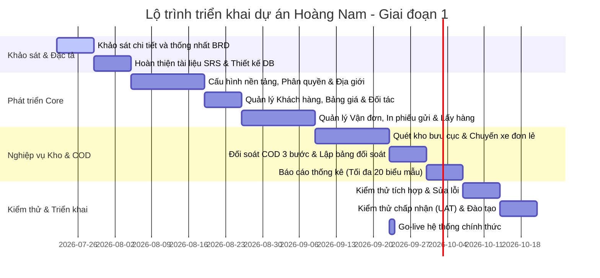

# Business Requirements Document (BRD)
**Dự án**: Hệ thống Quản lý Chuyển phát nhanh Hoàng Nam (Hoàng Nam Express) — Giai đoạn 1  
**Phiên bản**: 1.0  
**Ngày**: 2026-07-21  
**Tác giả**: BA Antigravity AI  
**Sponsor**: Ban Giám đốc Công ty Hoàng Nam  
**Trạng thái**: Draft / In Review  

---

## 1. Tóm tắt điều hành (Executive Summary)

Dự án phát triển **Hệ thống Quản lý Chuyển phát nhanh Hoàng Nam (Hoàng Nam Express) - Giai đoạn 1** nhằm số hóa toàn diện quy trình vận hành bưu chính và chuyển phát nhanh chặng cuối (Last-mile Delivery) của Công ty Hoàng Nam. Nền tảng được xây dựng dưới dạng **Web Quản lý (Web Portal)** tập trung cho nhân sự nội bộ (nhân viên văn phòng, thủ kho bưu cục, bưu tá/shipper, thủ quỹ, và quản trị viên).

Mục tiêu cốt lõi của giai đoạn này là giải quyết các bài toán vận hành thủ công, nâng cao tính chính xác trong việc tracking hành trình bưu gửi thông qua công nghệ quét mã vạch (barcode/QR code), kiểm soát nghiêm ngặt dòng tiền thu hộ (COD) mặt nộp về bưu cục, tự động hóa tính cước và đối soát công nợ khách hàng gửi cũng như quản lý giá mua dịch vụ liên kết với các đối tác vận chuyển thứ ba (3PL).

---

## 2. Bối cảnh kinh doanh (Business Context)

### 2.1 Vấn đề hiện tại
*   **Vận hành thủ công & dễ sai sót**: Việc tạo vận đơn, ghi nhận lịch trình, chia tuyến phát hàng cho bưu tá hiện tại chủ yếu thực hiện qua Excel hoặc ghi chép tay. Điều này gây trễ hạn xử lý đơn hàng và nhầm lẫn thông tin địa chỉ người nhận.
*   **Thất thoát hàng hóa tại kho bưu cục**: Thiếu quy trình quét mã vạch nhận/xuất trung chuyển ở các đầu bưu cục, dẫn đến việc mất mát hàng hóa trong quá trình luân chuyển giữa các kho chi nhánh/kho tổng mà không thể truy cứu trách nhiệm. (Lưu ý: Quy trình đóng bao trung chuyển bưu chính - Bagging/Cross-docking được trì hoãn sang Giai đoạn 2).
*   **Rủi ro thất thoát tiền mặt COD**: Mô hình giao hàng thu tiền hộ (COD) tại Việt Nam có lượng giao dịch tiền mặt rất lớn. Cuối ngày, bưu tá mang tiền mặt nộp về bưu cục nhưng thiếu luồng kiểm soát đối soát tự động và duyệt bảng kê thực nhận chặt chẽ, dễ gây thất thoát tài chính.
*   **Khó khăn trong quản lý công nợ & bảng giá**: Việc áp dụng bảng giá cước ưu đãi cho các nhóm khách hàng lớn hoặc đối soát công nợ gửi định kỳ hiện đang tính toán thủ công, mất từ 3-5 ngày làm việc cho mỗi kỳ đối soát và thường xuyên xảy ra khiếu nại sai lệch cước phí.

### 2.2 Cơ hội
*   Xây dựng hệ thống quản lý bưu chính chuẩn hóa theo mô hình hiện đại (tương tự GHN, GHTK, Viettel Post) giúp nâng cao năng lực cạnh tranh của Hoàng Nam trên thị trường.
*   Tối ưu hóa năng suất lao động của bưu tá và thủ kho nhờ quy trình quét mã vạch bằng thiết bị cầm tay hoặc camera.
*   Nắm bắt toàn bộ dòng tiền COD và công nợ khách hàng/đối tác theo thời gian thực, hỗ trợ đưa ra các quyết định kinh doanh kịp thời.

---

## 3. Mục tiêu dự án (Business Objectives)

Dự án áp dụng nguyên tắc **SMART** để xác định các mục tiêu cụ thể sau:
*   **BO1**: Số hóa 100% quy trình tiếp nhận yêu cầu lấy hàng, tạo vận đơn, quét mã vạch nhập/xuất kho và gán chuyến xe liên tỉnh trong vòng 3 tháng kể từ khi go-live.
*   **BO2**: Giảm thiểu tỷ lệ sai lệch hàng hóa tồn kho tại các bưu cục xuống dưới **0.2%** nhờ quy trình kiểm kho quét barcode theo thời gian thực.
*   **BO3**: Đảm bảo **100%** dòng tiền mặt COD thu được từ bưu tá được đối soát và duyệt qua bảng kê nộp tiền nội bộ trước 22:00 hàng ngày, đưa tỷ lệ thất thoát tiền mặt về **0%**.
*   **BO4**: Rút ngắn thời gian lập bảng kê đối soát công nợ gửi của khách hàng và công nợ mua dịch vụ 3PL từ **5 ngày** xuống dưới **1 ngày** cho mỗi chu kỳ thanh toán.
*   **BO5**: Khả năng phản hồi tra cứu thông tin hành trình vận đơn dưới **1 giây** cho cơ sở dữ liệu trên 100.000 đơn hàng hoạt động cùng lúc.

---

## 4. Phạm vi dự án (Scope)

### 4.1 Trong phạm vi (In-Scope)
Hệ thống Web Quản lý (Web Portal) bao gồm 9 phân hệ chức năng cốt lõi:
1.  **Quản lý nhân viên**: Phân chia phòng ban, chức vụ; quản lý thông tin tài khoản nhân sự tích hợp vai trò.
2.  **Quản lý cài đặt vận hành**:
    *   Danh mục địa giới hành chính tĩnh 3 cấp Việt Nam (Tỉnh/Thành, Quận/Huyện, Phường/Xã/Thị trấn) phục vụ tính cước.
    *   Cấu hình danh mục bưu cục/chi nhánh và phạm vi khu vực hoạt động/tuyến giao nhận bưu cục.
    *   Quản lý đội xe vận chuyển (xe máy của bưu tá, xe tải trung chuyển).
    *   Cấu hình phân quyền hệ thống chi tiết theo nhóm quyền/chức vụ.
    *   Cấu hình dịch vụ vận chuyển chính (tiêu chuẩn, hỏa tốc), dịch vụ gia tăng (bảo hiểm, giao tận tay) và phân loại loại hàng hóa (hàng cồng kềnh, dễ vỡ, tài liệu, chất lỏng).
3.  **Quản lý khách hàng**: Danh sách khách hàng gửi, phân nhóm khách hàng, thiết lập bảng giá cước chi tiết áp dụng riêng, và quản lý công nợ gửi định kỳ kèm bảng đối soát thanh toán.
4.  **Quản lý đối tác 3PL**: Quản lý thông tin kết nối các đối tác vận chuyển bên thứ ba và quản lý bảng giá cước mua dịch vụ 3PL.
5.  **Quản lý vận đơn**: Tiếp nhận và điều phối lấy hàng; tạo đơn thủ công và in phiếu gửi (với barcode/QR code); danh sách vận đơn và bộ lọc trạng thái; hủy trạng thái giao hàng thành công (rollback khi có khiếu nại); điều chỉnh COD trước khi xuất kho; nhật ký thay đổi thông tin đơn (Audit Log).
6.  **Quản lý kho bưu cục**:
    *   Quét mã vạch nhập kho bưu cục (khi nhận hàng từ bưu tá lấy hoặc bưu cục khác chuyển đến).
    *   Kiểm điểm tồn kho thực tế, đối soát số lượng, danh sách bưu gửi và tổng cân nặng.
    *   Quét mã xuất kho trung chuyển: Quét xuất kho trung chuyển đơn lẻ, quét xuất các vận đơn lẻ đi kho/bưu cục tiếp theo kèm bảng kê chi tiết (nghiệp vụ đóng bao tải lớn - Bagging được trì hoãn sang Giai đoạn 2).
    *   Quét xuất hàng đối tác 3PL: Bàn giao hàng cho đối tác vận chuyển ngoài kèm bảng kê.
    *   Quét xuất kho giao hàng: Bàn giao đơn cho bưu tá đi phát kèm bảng kê giao hàng.
    *   Quét xuất kho trả hàng: Xuất trả hàng hoàn về cho người gửi (Cấu hình sẵn khung nghiệp vụ, chưa áp dụng bắt buộc trong Giai đoạn 1).
    *   Lịch sử chi tiết thời gian thực xuất/nhập kho của từng đơn hàng.
7.  **Quản lý chuyển xe**: Theo dõi đội xe tải, tạo chuyến xe liên tỉnh/nội thành, gán tài xế, bốc xếp trực tiếp các vận đơn lẻ lên xe tải và ghi nhận hành trình xuất bến (nghiệp vụ bốc xếp bao trung chuyển được trì hoãn sang Giai đoạn 2).
8.  **Quản lý thu tiền (COD)**: Theo dõi dòng tiền thu hộ COD từ các đơn phát thành công; bưu tá nộp tiền và lập bảng kê thu tiền cuối ngày; thủ quỹ đối soát và xác nhận thực nhận tiền mặt trên hệ thống.
9.  **Báo cáo thống kê**: Cung cấp tối đa 20 biểu mẫu báo cáo thống kê động về doanh thu, sản lượng vận đơn, công nợ khách hàng và hiệu suất giao nhận của shipper.

### 4.2 Ngoài phạm vi (Out-of-Scope)
*   **Ứng dụng Mobile App gốc (Native/Hybrid App)**: Giai đoạn 1 chỉ phát triển nền tảng Web. Bưu tá/tài xế sẽ thao tác qua giao diện Web Responsive trên thiết bị di động cá nhân hoặc thực hiện ghi nhận thông qua nhân viên bưu cục.
*   **Định vị GPS thời gian thực trên bản đồ**: Chưa tích hợp bản đồ số theo dõi di chuyển thời gian thực của xe tải/bưu tá. Lịch trình chuyến xe và bưu tá được cập nhật dựa trên các cột mốc quét mã vạch và cập nhật trạng thái thủ công.
*   **Thanh toán điện tử online tự động**: Hệ thống Giai đoạn 1 không tích hợp cổng thanh toán trực tuyến (như thẻ tín dụng, ví điện tử). Việc thanh toán cước phí và COD được thực hiện hoàn toàn bằng tiền mặt hoặc chuyển khoản thủ công có đối soát duyệt tay.

### 4.3 Giả định (Assumptions)
*   Dữ liệu địa giới hành chính tĩnh của Việt Nam (tới cấp Phường/Xã) có sẵn để import vào cơ sở dữ liệu.
*   Nhân viên bưu cục và bưu tá có thiết bị di động/máy tính kết nối internet ổn định tại địa điểm làm việc để truy cập Web Portal.
*   Các đối tác 3PL (GHN, GHTK, Viettel Post...) cung cấp tài liệu API kết nối thử nghiệm kịp thời.

### 4.4 Ràng buộc (Constraints)
*   **Bản địa hóa**: 100% giao diện, thông báo lỗi, đơn vị đo lường (kg/gram, VNĐ) và định dạng số phải tuân thủ chuẩn tiếng Việt.
*   **Độ chính xác in ấn**: Các mẫu in phiếu gửi, bảng kê bao hàng, bảng kê giao hàng phải căn chỉnh chính xác theo khổ giấy nhiệt thông dụng (A6 hoặc A5) để in trực tiếp từ trình duyệt.
*   **Tính toàn vẹn**: Thông tin người gửi/nhận lúc tạo hóa đơn phải được đóng băng bằng cơ chế Snapshot, tránh việc thay đổi danh mục khách hàng làm thay đổi thông tin lịch sử của đơn hàng.

---

## 5. Stakeholder (Các bên liên quan)

| Vai trò | Đối tượng cụ thể | Trách nhiệm chính trong dự án | Mức ảnh hưởng |
| :--- | :--- | :--- | :---: |
| **Sponsor** | Ban Giám đốc Hoàng Nam | Phê duyệt ngân sách, thông qua phạm vi BRD và nghiệm thu dự án. | Cao |
| **Product Owner (PO)** | Trưởng phòng Vận hành | Định nghĩa cụ thể quy trình nghiệp vụ thực tế, tham gia kiểm thử chấp nhận (UAT) và duyệt sản phẩm đi vào hoạt động. | Cao |
| **Counter Staff (NV Bưu cục)** | Nhân viên tiếp nhận hàng | Tạo vận đơn thủ công, tiếp nhận yêu cầu lấy hàng, cân đo hàng hóa, thu tiền cước tại quầy. | Trung bình |
| **Warehouse Keeper (Thủ kho)** | Nhân viên kho bưu cục | Quét mã vạch nhập/xuất kho, thực hiện quét xuất kho trung chuyển đơn lẻ, kiểm kê số lượng và tổng cân nặng tồn kho thực tế. | Trung bình |
| **Shipper / Driver (Bưu tá)** | Nhân viên giao nhận | Đến địa chỉ lấy hàng, giao hàng chặng cuối cho người nhận, thu tiền COD mặt và bàn giao tiền mặt về bưu cục cuối ngày. | Thấp |
| **Cashier (Thủ quỹ)** | Nhân viên tài vụ bưu cục | Nhận tiền mặt COD từ bưu tá nộp về, kiểm đếm và bấm duyệt xác nhận bảng kê nộp tiền trên hệ thống. | Cao |
| **Tech Lead / Dev Team** | Đội ngũ phát triển phần mềm | Thiết kế kiến trúc DB, lập trình backend/frontend, cấu hình hạ tầng và hỗ trợ sửa lỗi kỹ thuật. | Cao |

---

## 6. Yêu cầu nghiệp vụ cấp cao (Business Requirements)

Các yêu cầu nghiệp vụ dưới đây được ánh xạ (map) trực tiếp từ danh sách các Use Case trong tài liệu cơ sở:

### 6.1 Phân hệ Quản lý Nhân sự & Phân Quyền (Staff & Authorization)
*   **BR-STAFF-01**: Hệ thống phải cho phép quản lý thông tin nhân sự tập trung. Chức năng phòng ban (UC-WEB-01) và chức vụ (UC-WEB-02) được gộp chung vào màn hình quản lý nhân viên (UC-WEB-03) để tối giản luồng thao tác. Một hồ sơ nhân viên phải bao gồm thông tin: Tên, số điện thoại, phòng ban, chức vụ, trạng thái hoạt động và vai trò tài khoản liên kết.
*   **BR-STAFF-02**: Cho phép cấu hình phân quyền chi tiết (UC-WEB-10). Quản trị viên có thể tạo các nhóm quyền (như Admin, Thủ kho, Thủ quỹ, Bưu tá, Nhân viên quầy) và gán chi tiết các quyền hạn truy cập chức năng hệ thống cho từng nhóm.

### 6.2 Phân hệ Cấu hình Hệ thống & Vận hành (Settings)
*   **BR-SETTING-01**: Cung cấp danh mục địa giới hành chính tĩnh Việt Nam gồm 3 cấp: Tỉnh/Thành phố (UC-WEB-04), Quận/Huyện (UC-WEB-05), và Phường/Xã/Thị trấn (UC-WEB-06) phục vụ việc lựa chọn địa chỉ gửi/nhận chuẩn hóa và làm cơ sở tính cước phí.
*   **BR-SETTING-02**: Quản lý danh mục Bưu cục/Chi nhánh (UC-WEB-07) và cấu hình khu vực hoạt động/tuyến giao nhận trực thuộc bưu cục (UC-WEB-08) được gộp chung để dễ dàng thiết lập bưu cục nào chịu trách nhiệm lấy/phát hàng cho những phường/xã nào.
*   **BR-SETTING-03**: Quản lý thông tin đội xe vận chuyển (UC-WEB-09) gồm: Biển số xe, loại xe (xe máy/xe tải), tải trọng, thể tích và tài xế phụ trách.
*   **BR-SETTING-04**: Quản lý cấu hình dịch vụ cước (UC-WEB-11) và loại hàng hóa (UC-WEB-12) được gộp chung để phục vụ tính phí tự động. Hệ thống cho phép định nghĩa các dịch vụ chính (Tiêu chuẩn, Hỏa tốc), dịch vụ gia tăng (Bảo hiểm bưu gửi, Giao tận tay) và phân loại nhóm hàng hóa đặc thù (Hàng cồng kềnh, Dễ vỡ, Tài liệu, Chất lỏng) có hệ số nhân cước phí hoặc phụ phí tương ứng.

### 6.3 Phân hệ Quản lý Khách hàng & Công nợ (Customer & Billing)
*   **BR-CUSTOMER-01**: Quản lý hồ sơ khách hàng gửi (UC-WEB-13) bao gồm thông tin liên hệ, phân loại nhóm khách hàng (khách lẻ thanh toán ngay, khách shop/doanh nghiệp thanh toán định kỳ).
*   **BR-CUSTOMER-02**: Thiết lập bảng giá cước chi tiết (UC-WEB-14) áp dụng riêng biệt cho từng khách hàng lớn hoặc nhóm khách hàng đặc thù dựa trên khoảng cách địa lý (Nội tỉnh, Nội vùng, Liên vùng), cân nặng hàng hóa và dịch vụ đi kèm.
*   **BR-CUSTOMER-03**: Quản lý công nợ khách hàng gửi (UC-WEB-15) theo chu kỳ (tuần/tháng/quý). Hệ thống tự động gom các vận đơn đã giao thành công của khách hàng trong kỳ để lập bảng đối soát chi tiết, ghi nhận thanh toán thực tế của khách và theo dõi dư nợ còn lại.

### 6.4 Phân hệ Quản lý Đối tác 3PL (Partner Management)
*   **BR-PARTNER-01**: Quản lý thông tin đối tác vận chuyển bên thứ 3 (3PL) (UC-WEB-16) và bảng giá mua cước dịch vụ từ đối tác 3PL (UC-WEB-17) được gộp chung. Hệ thống ghi nhận thông tin kết nối API, dịch vụ cung cấp và bảng giá mua cước của các đối tác liên kết (như GHN, GHTK, Viettel Post) để phục vụ việc tính toán giá vốn khi đẩy đơn sang đối tác vận chuyển ngoài.

### 6.5 Phân hệ Quản lý Vận đơn (Waybill Management)
*   **BR-WAYBILL-01**: Quản lý lấy hàng (UC-WEB-18) tiếp nhận yêu cầu gửi hàng của khách từ hệ thống, điều phối bưu tá đi nhận hàng tại địa điểm yêu cầu, cập nhật trạng thái "Đang đi lấy hàng" -> "Đã lấy hàng thành công".
*   **BR-WAYBILL-02**: Tạo vận đơn thủ công (UC-WEB-19) cho phép nhân viên quầy nhập chi tiết thông tin người gửi, người nhận, thông tin hàng hóa (khối lượng, kích thước, loại hàng hóa), dịch vụ sử dụng, số tiền COD thu hộ và các loại cước phí. Hệ thống hỗ trợ in phiếu gửi có mã vạch (Barcode/QR code) chuẩn hóa khổ giấy A5/A6.
*   **BR-WAYBILL-03**: Danh sách vận đơn (UC-WEB-23) cung cấp giao diện tra cứu tổng thể với bộ lọc thông minh theo mã đơn, số điện thoại gửi/nhận, khoảng thời gian và các trạng thái hành trình (như Chờ lấy hàng, Đã nhập kho bưu cục, Đang trung chuyển, Đang giao hàng, Giao thành công, Chờ trả lại...).
*   **BR-WAYBILL-04**: Hủy trạng thái giao hàng thành công (UC-WEB-24) cho phép người quản lý có thẩm quyền rollback trạng thái vận đơn từ "Giao thành công" về trạng thái trước đó (như Đang giao hàng hoặc Đã nhập kho phát) khi phát hiện lỗi cập nhật nhầm hoặc có khiếu nại phát sinh từ người nhận, đồng thời ghi nhận lý do hủy trạng thái.
*   **BR-WAYBILL-05**: Cho phép cập nhật/điều chỉnh số tiền thu hộ COD (UC-WEB-26) của vận đơn trước khi bưu gửi được xuất kho bàn giao cho bưu tá đi phát, đảm bảo tính khớp số liệu khi có yêu cầu thay đổi từ người gửi.
*   **BR-WAYBILL-06**: Ghi nhật ký lịch sử điều chỉnh đơn hàng (UC-WEB-27). Toàn bộ thao tác thay đổi thông tin vận đơn, cập nhật cước phí hay thay đổi COD phải được lưu lại dưới dạng Audit Log chi tiết (ai sửa, sửa lúc nào, giá trị cũ và mới).

### 6.7 Phân hệ Nghiệp vụ Kho Bưu cục (Hub Operations)
*   **BR-WAREHOUSE-01**: Nghiệp vụ nhập kho (UC-WEB-28) cho phép nhân viên kho dùng mã vạch quét nhận bưu gửi từ bưu tá lấy về hoặc từ chuyến xe trung chuyển từ bưu cục khác chuyển tới.
*   **BR-WAREHOUSE-02**: Nghiệp vụ kiểm điểm kho (UC-WEB-29). Nhân viên kho quét bưu gửi thực tế tại kho bưu cục để đối soát tồn kho, lệch thừa/thiếu, kiểm điểm danh sách và tổng khối lượng.
*   **BR-WAREHOUSE-03**: Nghiệp vụ xuất kho trung chuyển đơn lẻ (UC-WEB-30). Quét xuất kho trung chuyển: quét gán nhiều vận đơn lẻ cần chuyển đi, in bảng kê chi tiết danh sách vận đơn trung chuyển (danh sách vận đơn, tổng khối lượng) và quét xuất đi bưu cục tiếp theo hoặc kho tổng. (Nghiệp vụ đóng bao trung chuyển bưu chính - Bagging được trì hoãn sang Giai đoạn 2).
*   **BR-WAREHOUSE-04**: Nghiệp vụ xuất hàng đối tác (UC-WEB-31). Quét mã vạch bàn giao đơn cho đối tác 3PL và xuất bảng kê bàn giao đơn cho đối tác.
*   **BR-WAREHOUSE-05**: Nghiệp vụ xuất kho giao hàng (UC-WEB-32). Quét mã vận đơn bàn giao cho bưu tá đi giao chặng cuối và in kèm bảng kê giao hàng chi tiết.
*   **BR-WAREHOUSE-06**: Nghiệp vụ xuất kho trả hàng (UC-WEB-33). Thực hiện xuất kho trả hàng hoàn về cho người gửi đối với các đơn giao không thành công (chuẩn bị khung nghiệp vụ trạng thái).
*   **BR-WAREHOUSE-07**: Nhật ký lịch sử xuất/nhập kho (UC-WEB-34) theo dõi chi tiết thời gian và nhân sự thực hiện quét xuất/nhập kho cho từng vận đơn độc lập.

### 6.8 Phân hệ Quản lý Chuyển xe (Fleet & Trip Management)
*   **BR-TRIP-01**: Theo dõi trạng thái hoạt động (sẵn sàng, vận hành, bảo dưỡng) và lịch trình sử dụng của đội xe tải vận tải (UC-WEB-35).
*   **BR-TRIP-02**: Nghiệp vụ chuyến xe (UC-WEB-36) cho phép tạo chuyến xe, gán tài xế phụ trách, bốc xếp trực tiếp các vận đơn lẻ lên xe tải và ghi nhận hành trình xuất bến (nghiệp vụ bốc xếp bao hàng trung chuyển được trì hoãn sang Giai đoạn 2).

### 6.9 Phân hệ Quản lý Dòng tiền thu hộ COD (COD Handover & Cash Control)
*   **BR-COD-01**: Theo dõi đối soát tổng dòng tiền thu hộ COD (UC-WEB-37) từ toàn bộ các đơn hàng đã phát thành công trên hệ thống.
*   **BR-COD-02**: Nghiệp vụ thu tiền nhân viên (UC-WEB-38). Cuối ngày, bưu tá tạo bảng kê nộp tiền trên hệ thống liệt kê danh sách mã đơn giao thành công kèm số tiền mặt thu được nộp về bưu cục.
*   **BR-COD-03**: Nghiệp vụ xác nhận thu tiền (UC-WEB-39). Thủ quỹ bưu cục đếm tiền mặt thực tế từ bưu tá nộp về, đối chiếu với bảng kê nộp tiền trên hệ thống và bấm duyệt xác nhận đã nhận đủ tiền mặt từ bưu tá.

### 6.10 Phân hệ Báo cáo Thống kê (Reports & Analytics)
*   **BR-REPORT-01**: Hệ thống cung cấp tối đa 20 biểu mẫu báo cáo thống kê động (UC-WEB-40) phục vụ quản lý bao gồm: Báo cáo doanh thu vận chuyển, báo cáo sản lượng đơn hàng, báo cáo công nợ gửi khách hàng, và báo cáo hiệu suất giao nhận của bưu tá.

---

## 7. Phân tích lợi ích (Benefits / Business Case)

### 7.1 Lợi ích hữu hình (Tangible Benefits)
*   **Tiết kiệm chi phí vận hành**: Việc quét mã vạch và tự động hóa chia tuyến giúp bưu cục giảm thiểu 20-30% chi phí nhân sự xử lý thủ công tại kho.
*   **Loại bỏ thất thoát tài chính**: Việc đối soát COD chặt chẽ 3 bước giúp phát hiện ngay lập tức các sai lệch tiền mặt của bưu tá, đưa tỷ lệ thất thoát tiền mặt về **0%**.
*   **Rút ngắn thời gian đối soát công nợ**: Tự động hóa đối soát công nợ gửi và công nợ 3PL giảm từ 5 ngày làm việc xuống còn dưới 1 ngày làm việc, giúp dòng tiền luân chuyển nhanh hơn.

### 7.2 Lợi ích vô hình (Intangible Benefits)
*   **Nâng cao trải nghiệm khách hàng**: Cập nhật hành trình đơn hàng chính xác giúp khách hàng tin tưởng và tăng tỷ lệ giữ chân khách hàng gửi.
*   **Minh bạch dữ liệu nội bộ**: Audit Log chi tiết giúp ban giám đốc dễ dàng truy vết trách nhiệm khi xảy ra sự cố mất hàng hoặc cập nhật sai lệch thông tin đơn hàng.
*   **Nền tảng mở rộng linh hoạt**: Thiết kế monorepo chuẩn hóa giúp dễ dàng tích hợp thêm các đối tác vận chuyển thứ ba mới mà không cần đập đi xây lại hệ thống.

---

## 8. Tiêu chí thành công (Success Criteria / KPI)

| ID | Chỉ số KPI chính | Baseline (Hiện tại) | Target (Sau 3 tháng Go-live) | Phương pháp đo lường |
| :--- | :--- | :---: | :---: | :--- |
| **KPI-1** | Tỷ lệ bưu gửi được quét barcode nhập/xuất kho | 0% | > 99.8% | Báo cáo kiểm toán hệ thống (số lượng đơn nhập kho so với số đơn tạo mới) |
| **KPI-2** | Tỷ lệ thất thoát tiền mặt COD nội bộ | N/A (chưa đo lường) | 0% | Bảng đối soát số dư két sắt bưu cục thực tế so với tổng tiền đã xác nhận trên bảng kê |
| **KPI-3** | Tỷ lệ giao hàng thành công chặng cuối | ~85% | > 92% | Báo cáo sản lượng giao nhận của bưu tá |
| **KPI-4** | Thời gian phản hồi trang Web quản lý | > 3s | < 1s | Công cụ giám sát hiệu năng hệ thống (APM) |
| **KPI-5** | Thời gian hoàn tất đối soát công nợ định kỳ | 5 ngày | < 1 ngày | Nhật ký thời gian xuất bảng đối soát và ghi nhận thanh toán của kế toán |

---

## 9. Phân tích rủi ro (Risks & Mitigation)

| ID | Rủi ro tiềm ẩn | Khả năng xảy ra | Mức độ tác động | Giải pháp giảm thiểu (Mitigation) |
| :--- | :--- | :---: | :---: | :--- |
| **R1** | Nhân viên bưu cục, bưu tá không quen thao tác quét barcode và quét trung chuyển đơn lẻ. | Cao | Trung bình | Tổ chức các buổi đào tạo trực tiếp tại bưu cục, thiết kế tài liệu hướng dẫn nhanh dạng Infographic dán tại kho, và xây dựng giao diện quét đơn giản, hỗ trợ quét liên tục (bulk scan). |
| **R2** | API kết nối với các đối tác 3PL (GHN, GHTK, Viettel Post) gặp sự cố gián đoạn hoặc phản hồi chậm. | Trung bình | Cao | Thiết kế module kết nối 3PL độc lập, sử dụng hàng đợi (Queue) để xử lý bất đồng bộ, có cơ chế tự động thử lại (Retry Mechanism) và cho phép nhân viên cập nhật mã vận đơn đối tác bằng tay nếu API lỗi kéo dài. |
| **R3** | Thiết lập bảng giá cước phức tạp bị lỗi tính toán dẫn đến tính cước sai cho khách hàng lớn. | Trung bình | Cao | Xây dựng chức năng mô phỏng tính cước (công cụ test cước) trên giao diện admin để kế toán nhập thử thông tin đơn hàng và kiểm tra cước tính toán trước khi áp dụng chính thức bảng giá cước mới. |
| **R4** | Sai lệch trọng lượng hàng hóa thực tế khi kiểm kho bưu cục (do bưu tá nhập sai lúc lấy hàng). | Cao | Thấp | Cấu hình cho phép một khoảng sai số cân nặng được chấp nhận (ví dụ ±50g), nếu vượt quá sai số sẽ cảnh báo để nhân viên bưu cục cân lại và cập nhật trọng lượng mới trước khi xuất kho trung chuyển. |

---

## 10. Lộ trình triển khai cấp cao (High-level Roadmap)

Lộ trình triển khai Giai đoạn 1 dự kiến kéo dài trong **9 tuần**:

---

## 11. Phê duyệt (Sign-off)

Tài liệu được thông qua bởi các bên đại diện dưới đây:

| Đại diện bên phê duyệt | Họ và tên | Chức vụ | Chữ ký | Ngày phê duyệt |
| :--- | :--- | :--- | :--- | :--- |
| **Sponsor (Chủ đầu tư)** | | Giám đốc Công ty Hoàng Nam | | |
| **Product Owner (PO)** | | Trưởng phòng Vận hành | | |
| **Business Analyst (BA)** | | BA phụ trách dự án | | |
| **Tech Lead** | | Đại diện đội ngũ phát triển | | |
