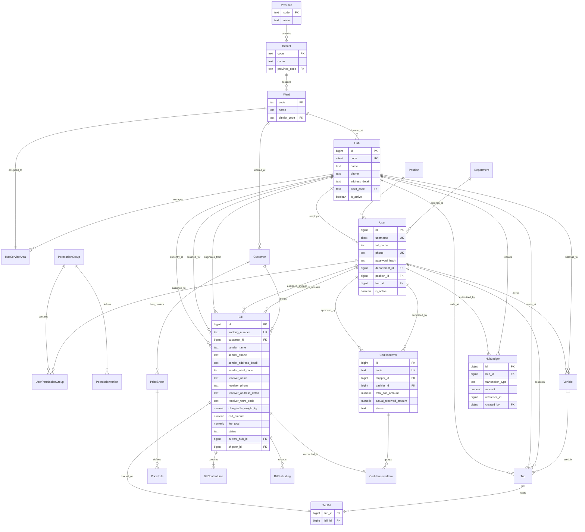

# Database Schema Design (Hoàng Nam Express)
**Dự án**: Hệ thống Quản lý Chuyển phát nhanh Hoàng Nam (Hoàng Nam Express) — Giai đoạn 1  
**Phiên bản**: 1.0  
**Ngày**: 2026-07-21  
**Tác giả**: Solution Architect Antigravity AI  
**Hệ quản trị CSDL**: PostgreSQL 16 (với các extensions `unaccent`, `pg_trgm`, `citext`)  
**Công nghệ tích hợp**: Async SQLAlchemy 2.x ORM  

Tài liệu này đặc tả chi tiết thiết kế Cơ sở dữ liệu quan hệ (Entity-Relationship Diagram - ERD) và Từ điển dữ liệu (Data Dictionary) mở rộng từ thiết kế lõi của VeloxShip để đáp ứng toàn bộ các yêu cầu nghiệp vụ của dự án Hoàng Nam - Giai đoạn 1.

---

## 1. Sơ đồ thực thể quan hệ (ERD - Mermaid Diagram)



---

## 2. Tiêu chuẩn kiểu dữ liệu dự án (Standards)
*   **Tiền tệ (Money/COD)**: Sử dụng kiểu `NUMERIC(14, 2)` nhằm lưu trữ chính xác giá trị tiền tệ VNĐ không bị sai số làm tròn (float/real).
*   **Khối lượng (Weight)**: Sử dụng kiểu `NUMERIC(12, 3)` (Đơn vị tính: **kg**), cho phép chính xác tới 3 chữ số thập phân (tương đương 1 gram).
*   **Kích thước (Dimensions)**: Sử dụng kiểu `NUMERIC(8, 2)` (Đơn vị tính: **cm**).
*   **Thời gian**: Sử dụng kiểu `TIMESTAMPTZ` (Timestamp với múi giờ), bắt buộc lưu múi giờ UTC ở database và render sang múi giờ `Asia/Ho_Chi_Minh` ở phía client.

---

## 3. Từ điển dữ liệu chi tiết các bảng (Data Dictionary)

### 3.1 Phân hệ Hành chính Địa giới (Administrative Divisions)

#### Bảng `provinces` — Tỉnh/Thành phố
*   Lưu danh mục Tỉnh/Thành phố tĩnh trên toàn quốc.

| Tên Column | Kiểu dữ liệu | Ràng buộc | Giá trị mặc định | Giải nghĩa |
| :--- | :--- | :--- | :--- | :--- |
| `code` | `TEXT` | PK | — | Mã hành chính tỉnh (ví dụ: '79') |
| `name` | `TEXT` | NOT NULL | — | Tên tỉnh/thành tiếng Việt |
| `name_en` | `TEXT` | NULL | — | Tên tiếng Anh |
| `created_at`| `TIMESTAMPTZ`| NOT NULL | `now()` | Thời gian tạo |

#### Bảng `districts` — Quận/Huyện
*   Lưu danh mục Quận/Huyện liên kết với Tỉnh/Thành phố.

| Tên Column | Kiểu dữ liệu | Ràng buộc | Giá trị mặc định | Giải nghĩa |
| :--- | :--- | :--- | :--- | :--- |
| `code` | `TEXT` | PK | — | Mã hành chính quận/huyện |
| `name` | `TEXT` | NOT NULL | — | Tên quận/huyện |
| `name_en` | `TEXT` | NULL | — | Tên tiếng Anh |
| `province_code`| `TEXT` | FK → `provinces.code` | — | Liên kết mã tỉnh |
| `created_at`| `TIMESTAMPTZ`| NOT NULL | `now()` | Thời gian tạo |

#### Bảng `wards` — Phường/Xã
*   Lưu danh mục Phường/Xã/Thị trấn trực thuộc Quận/Huyện.

| Tên Column | Kiểu dữ liệu | Ràng buộc | Giá trị mặc định | Giải nghĩa |
| :--- | :--- | :--- | :--- | :--- |
| `code` | `TEXT` | PK | — | Mã hành chính phường/xã |
| `name` | `TEXT` | NOT NULL | — | Tên phường/xã/thị trấn |
| `name_en` | `TEXT` | NULL | — | Tên tiếng Anh |
| `district_code`| `TEXT` | FK → `districts.code` | — | Liên kết mã quận/huyện |
| `created_at`| `TIMESTAMPTZ`| NOT NULL | `now()` | Thời gian tạo |

---

### 3.2 Phân hệ Bưu cục & Nhân viên (Hubs & Staff)

#### Bảng `hubs` — Bưu cục / Chi nhánh
*   Đại diện cho các bưu cục giao nhận, kho trung chuyển hoặc kho tổng.

| Tên Column | Kiểu dữ liệu | Ràng buộc | Giá trị mặc định | Giải nghĩa |
| :--- | :--- | :--- | :--- | :--- |
| `id` | `BIGINT` | PK, GENERATED | — | Định danh bưu cục |
| `code` | `CITEXT` | UNIQUE, NOT NULL | — | Mã bưu cục (ví dụ: 'BCHCM01') |
| `name` | `TEXT` | NOT NULL | — | Tên bưu cục |
| `phone` | `TEXT` | NOT NULL | — | Số điện thoại bưu cục |
| `address_detail`| `TEXT` | NOT NULL | — | Số nhà, tên đường |
| `ward_code` | `TEXT` | FK → `wards.code` | — | Liên kết địa giới Phường/Xã |
| `is_active` | `BOOLEAN` | NOT NULL | `true` | Trạng thái hoạt động |
| `created_at` | `TIMESTAMPTZ`| NOT NULL | `now()` | Thời gian tạo |
| `updated_at` | `TIMESTAMPTZ`| NOT NULL | `now()` | Thời gian chỉnh sửa |

#### Bảng `hub_service_areas` — Tuyến phục vụ của bưu cục
*   Quy định bưu cục nào chịu trách nhiệm lấy và phát hàng cho Phường/Xã nào.

| Tên Column | Kiểu dữ liệu | Ràng buộc | Giá trị mặc định | Giải nghĩa |
| :--- | :--- | :--- | :--- | :--- |
| `hub_id` | `BIGINT` | PK, FK → `hubs.id` (CASCADE) | — | Định danh bưu cục |
| `ward_code` | `TEXT` | PK, FK → `wards.code` (CASCADE)| — | Mã phường/xã phụ trách |

*   *Ràng buộc*: `ward_code` là duy nhất ở mức logic. (Một xã chỉ gán cho tối đa 1 bưu cục lấy/phát để tránh chồng chéo tuyến).

#### Bảng `departments` — Phòng ban nhân sự
| Tên Column | Kiểu dữ liệu | Ràng buộc | Giá trị mặc định | Giải nghĩa |
| :--- | :--- | :--- | :--- | :--- |
| `id` | `BIGINT` | PK, GENERATED | — | Định danh phòng ban |
| `name` | `TEXT` | UNIQUE, NOT NULL | — | Tên phòng ban (ví dụ: 'Vận hành') |
| `description`| `TEXT` | NULL | — | Mô tả ngắn |

#### Bảng `positions` — Chức vụ nhân viên
| Tên Column | Kiểu dữ liệu | Ràng buộc | Giá trị mặc định | Giải nghĩa |
| :--- | :--- | :--- | :--- | :--- |
| `id` | `BIGINT` | PK, GENERATED | — | Định danh chức vụ |
| `name` | `TEXT` | UNIQUE, NOT NULL | — | Tên chức vụ (ví dụ: 'Thủ kho') |
| `description`| `TEXT` | NULL | — | Mô tả ngắn |

#### Bảng `users` — Tài khoản Nhân viên (Cập nhật)
*   Mở rộng bảng `users` cũ để quản lý chi tiết vị trí làm việc tại bưu cục.

| Tên Column | Kiểu dữ liệu | Ràng buộc | Giá trị mặc định | Giải nghĩa |
| :--- | :--- | :--- | :--- | :--- |
| `id` | `BIGINT` | PK, GENERATED | — | Định danh nhân viên |
| `username` | `CITEXT` | UNIQUE, NOT NULL | — | Tên đăng nhập |
| `full_name` | `TEXT` | NOT NULL | — | Họ và tên |
| `phone` | `TEXT` | UNIQUE, NOT NULL | — | Số điện thoại nhân viên |
| `password_hash`| `TEXT` | NOT NULL | — | Mật khẩu băm (bcrypt) |
| `department_id`| `BIGINT` | FK → `departments.id` | — | Phòng ban trực thuộc |
| `position_id` | `BIGINT` | FK → `positions.id` | — | Chức vụ trực thuộc |
| `hub_id` | `BIGINT` | FK → `hubs.id` | — | Bưu cục làm việc trực tiếp |
| `is_active` | `BOOLEAN` | NOT NULL | `true` | Trạng thái hoạt động |
| `created_at` | `TIMESTAMPTZ`| NOT NULL | `now()` | Thời gian tạo |
| `updated_at` | `TIMESTAMPTZ`| NOT NULL | `now()` | Thời gian chỉnh sửa |

---

### 3.3 Phân hệ Phân Quyền Hệ Thống (Authorization)

#### Bảng `permission_groups` — Nhóm quyền / Vai trò
| Tên Column | Kiểu dữ liệu | Ràng buộc | Giá trị mặc định | Giải nghĩa |
| :--- | :--- | :--- | :--- | :--- |
| `id` | `BIGINT` | PK, GENERATED | — | Định danh nhóm quyền |
| `name` | `TEXT` | UNIQUE, NOT NULL | — | Tên nhóm quyền (ví dụ: 'Kế toán bưu cục') |
| `description`| `TEXT` | NULL | — | Mô tả |

#### Bảng `user_permission_groups` — Bảng gán nhóm quyền cho nhân viên
| Tên Column | Kiểu dữ liệu | Ràng buộc | Giá trị mặc định | Giải nghĩa |
| :--- | :--- | :--- | :--- | :--- |
| `user_id` | `BIGINT` | PK, FK → `users.id` (CASCADE) | — | Định danh nhân viên |
| `group_id` | `BIGINT` | PK, FK → `permission_groups.id` (CASCADE) | — | Định danh nhóm quyền |

#### Bảng `permission_actions` — Hành động chi tiết được phân quyền
| Tên Column | Kiểu dữ liệu | Ràng buộc | Giá trị mặc định | Giải nghĩa |
| :--- | :--- | :--- | :--- | :--- |
| `group_id` | `BIGINT` | PK, FK → `permission_groups.id` (CASCADE) | — | Liên kết nhóm quyền |
| `action` | `TEXT` | PK | — | Ký hiệu quyền (ví dụ: 'bill:create') |

---

### 3.4 Bảng Giá Cước Khách Hàng (Pricing & Tariffs)

#### Bảng `price_sheets` — Bảng giá cước áp dụng
*   Lưu thông tin bảng giá áp dụng cho khách hàng hoặc nhóm khách hàng cụ thể.

| Tên Column | Kiểu dữ liệu | Ràng buộc | Giá trị mặc định | Giải nghĩa |
| :--- | :--- | :--- | :--- | :--- |
| `id` | `BIGINT` | PK, GENERATED | — | Định danh bảng giá |
| `name` | `TEXT` | NOT NULL | — | Tên bảng giá (ví dụ: 'Bảng giá Shop VIP VIP') |
| `customer_id` | `BIGINT` | FK → `customers.id` (NULL) | `NULL` | Gán riêng cho 1 khách hàng |
| `customer_group`| `TEXT` | CHECK IN ('retail', 'shop', 'enterprise') | `NULL` | Hoặc gán cho cả nhóm khách hàng |
| `is_active` | `BOOLEAN` | NOT NULL | `true` | Trạng thái hiệu lực |
| `created_at` | `TIMESTAMPTZ`| NOT NULL | `now()` | Thời gian tạo |
| `updated_at` | `TIMESTAMPTZ`| NOT NULL | `now()` | Thời gian chỉnh sửa |

*   *Ràng buộc*: `CHECK (customer_id IS NOT NULL OR customer_group IS NOT NULL)`.

#### Bảng `price_rules` — Chi tiết quy tắc tính cước của bảng giá
| Tên Column | Kiểu dữ liệu | Ràng buộc | Giá trị mặc định | Giải nghĩa |
| :--- | :--- | :--- | :--- | :--- |
| `id` | `BIGINT` | PK, GENERATED | — | Định danh quy tắc |
| `price_sheet_id`| `BIGINT` | FK → `price_sheets.id` (CASCADE) | — | Liên kết bảng giá |
| `service_tier_code`| `TEXT`| FK → `service_tiers.code` | — | Gói dịch vụ vận chuyển |
| `route_type` | `TEXT` | CHECK IN ('intra_province', 'intra_region', 'inter_region') | — | Tuyến đường: Nội tỉnh / Nội vùng / Liên vùng |
| `max_weight_kg`| `NUMERIC(12,3)`| NOT NULL, CHECK ≥ 0 | — | Mốc cân nặng tối đa tính cước nền |
| `base_fee` | `NUMERIC(14,2)`| NOT NULL, CHECK ≥ 0 | 0.00 | Cước phí nền (VNĐ) |
| `step_weight_kg`| `NUMERIC(12,3)`| NOT NULL, CHECK > 0 | — | Bước cân cộng thêm tiếp theo |
| `step_fee` | `NUMERIC(14,2)`| NOT NULL, CHECK ≥ 0 | 0.00 | Đơn giá cước cộng thêm trên mỗi bước |

---

### 3.5 Đội Xe & Chuyến Xe Trung Chuyển (Fleet & Trips)

#### Bảng `vehicles` — Đội xe bưu cục
*   Quản lý thông tin xe tải trung chuyển hoặc xe máy bưu tá giao hàng.

| Tên Column | Kiểu dữ liệu | Ràng buộc | Giá trị mặc định | Giải nghĩa |
| :--- | :--- | :--- | :--- | :--- |
| `id` | `BIGINT` | PK, GENERATED | — | Định danh xe |
| `license_plate`| `TEXT` | UNIQUE, NOT NULL | — | Biển số xe (ví dụ: '29C-123.45') |
| `vehicle_type` | `TEXT` | CHECK IN ('motorcycle', 'truck') | — | Loại xe tải/xe máy |
| `max_weight_kg`| `NUMERIC(12,3)`| NOT NULL | — | Khối lượng tải tối đa |
| `max_volume_m3`| `NUMERIC(8,2)` | NOT NULL | — | Thể tích thùng xe tối đa |
| `current_hub_id`| `BIGINT`| FK → `hubs.id` | — | Bưu cục quản lý xe hiện tại |
| `driver_id` | `BIGINT` | FK → `users.id` | `NULL` | Tài xế phụ trách mặc định |
| `status` | `TEXT` | CHECK IN ('active', 'inactive', 'maintenance') | 'active' | Trạng thái hoạt động của xe |
| `created_at` | `TIMESTAMPTZ`| NOT NULL | `now()` | Thời gian tạo |
| `updated_at` | `TIMESTAMPTZ`| NOT NULL | `now()` | Thời gian chỉnh sửa |

#### Bảng `trips` — Chuyến xe trung chuyển
*   Lịch trình xe tải chuyển bao tải trung chuyển giữa các bưu cục chi nhánh/kho tổng.

| Tên Column | Kiểu dữ liệu | Ràng buộc | Giá trị mặc định | Giải nghĩa |
| :--- | :--- | :--- | :--- | :--- |
| `id` | `BIGINT` | PK, GENERATED | — | Định danh chuyến xe |
| `code` | `TEXT` | UNIQUE, NOT NULL | — | Mã chuyến xe duy nhất |
| `vehicle_id` | `BIGINT` | FK → `vehicles.id` | — | Xe tải sử dụng |
| `driver_id` | `BIGINT` | FK → `users.id` | — | Tài xế điều khiển |
| `origin_hub_id`| `BIGINT`| FK → `hubs.id` | — | Bưu cục xuất phát |
| `destination_hub_id`| `BIGINT`| FK → `hubs.id`| — | Bưu cục đích đến |
| `status` | `TEXT` | CHECK IN ('scheduled', 'loading', 'in_transit', 'arrived', 'completed') | 'scheduled' | Trạng thái hành trình của chuyến xe |
| `start_odometer`| `INTEGER`| NULL | — | Số công-tơ-mét khi xuất bến |
| `end_odometer` | `INTEGER`| NULL | — | Số công-tơ-mét khi đến bến |
| `created_at` | `TIMESTAMPTZ`| NOT NULL | `now()` | Thời gian tạo |
| `updated_at` | `TIMESTAMPTZ`| NOT NULL | `now()` | Thời gian chỉnh sửa |

---

### 3.6 Đối Tác Vận Chuyển Ngoài (3PL Partners)

#### Bảng `partners` — Đối tác 3PL liên kết
| Tên Column | Kiểu dữ liệu | Ràng buộc | Giá trị mặc định | Giải nghĩa |
| :--- | :--- | :--- | :--- | :--- |
| `id` | `BIGINT` | PK, GENERATED | — | Định danh đối tác |
| `code` | `CITEXT` | UNIQUE, NOT NULL | — | Mã đối tác (GHN, GHTK...) |
| `name` | `TEXT` | NOT NULL | — | Tên đối tác vận chuyển |
| `api_url` | `TEXT` | NOT NULL | — | Endpoint API kết nối |
| `api_token` | `TEXT` | NOT NULL | — | Token xác thực kết nối |
| `is_active` | `BOOLEAN` | NOT NULL | `true` | Trạng thái kết nối |
| `created_at` | `TIMESTAMPTZ`| NOT NULL | `now()` | Thời gian tạo |
| `updated_at` | `TIMESTAMPTZ`| NOT NULL | `now()` | Thời gian chỉnh sửa |

#### Bảng `partner_tariffs` — Giá cước mua 3PL
*   Lưu biểu phí mua cước của đối tác 3PL để làm căn cứ tính giá vốn dịch vụ.

| Tên Column | Kiểu dữ liệu | Ràng buộc | Giá trị mặc định | Giải nghĩa |
| :--- | :--- | :--- | :--- | :--- |
| `id` | `BIGINT` | PK, GENERATED | — | Định danh dòng cước mua |
| `partner_id` | `BIGINT` | FK → `partners.id` (CASCADE) | — | Đối tác 3PL tương ứng |
| `service_name` | `TEXT` | NOT NULL | — | Tên gói dịch vụ đối tác cung cấp |
| `route_type` | `TEXT` | NOT NULL | — | Vùng tuyến (nội tỉnh, liên vùng...) |
| `base_fee` | `NUMERIC(14,2)`| NOT NULL, CHECK ≥ 0 | 0.00 | Đơn giá cước mua nền |

---

### 3.7 Vận Đơn & Kho Trung Chuyển (Bills & Warehousing)

#### Bảng `bills` — Vận đơn / Phiếu gửi (Cập nhật)
*   Mở rộng từ bảng `bills` của VeloxShip để hỗ trợ dòng tiền COD, bưu cục quản lý tĩnh, gán bưu tá và đối tác ngoại.

| Tên Column | Kiểu dữ liệu | Ràng buộc | Giá trị mặc định | Giải nghĩa |
| :--- | :--- | :--- | :--- | :--- |
| `id` | `BIGINT` | PK, GENERATED | — | Định danh vận đơn |
| `tracking_number`| `TEXT` | UNIQUE, NOT NULL | — | Mã vận đơn duy nhất |
| `customer_id` | `BIGINT` | FK → `customers.id` (NULL) | `NULL` | Khách hàng gửi (nếu có tài khoản) |
| `customer_code`| `CITEXT` | NULL | — | Mã khách hàng snapshot |
| **Sender Snapshot** | | | | |
| `sender_name` | `TEXT` | NOT NULL | — | Họ tên người gửi |
| `sender_phone` | `TEXT` | NOT NULL | — | SĐT người gửi |
| `sender_address_detail`| `TEXT` | NOT NULL | — | Địa chỉ chi tiết người gửi |
| `sender_ward_code`| `TEXT` | FK → `wards.code` | — | Phường/Xã người gửi |
| **Receiver Snapshot** | | | | |
| `receiver_name`| `TEXT` | NOT NULL | — | Họ tên người nhận |
| `receiver_phone`| `TEXT` | NOT NULL | — | SĐT người nhận |
| `receiver_address_detail`| `TEXT`| NOT NULL | — | Địa chỉ chi tiết người nhận |
| `receiver_ward_code`| `TEXT` | FK → `wards.code` | — | Phường/Xã người nhận |
| **Cargo Details** | | | | |
| `cargo_type` | `TEXT` | CHECK IN ('document', 'goods')| — | Phân loại Tài liệu / Hàng hóa |
| `service_tier_code`| `TEXT`| FK → `service_tiers.code` | — | Gói dịch vụ chính sử dụng |
| `actual_weight_kg`| `NUMERIC(12,3)`| NOT NULL, CHECK ≥ 0 | — | Cân nặng thực tế đo tại quầy |
| `chargeable_weight_kg`| `NUMERIC(12,3)`| NOT NULL, CHECK ≥ 0 | — | Cân nặng tính cước sau quy đổi |
| `is_insurance_required`| `BOOLEAN`| NOT NULL | `false` | Có mua bảo hiểm hàng hóa không |
| `cod_amount` | `NUMERIC(14,2)`| NOT NULL, CHECK ≥ 0 | 0.00 | Số tiền thu hộ COD (VNĐ) |
| **Fees Details** | | | | |
| `fee_main` | `NUMERIC(14,2)`| NOT NULL, CHECK ≥ 0 | 0.00 | Cước chính vận chuyển |
| `fee_insurance`| `NUMERIC(14,2)`| NOT NULL, CHECK ≥ 0 | 0.00 | Phí bảo hiểm hàng hóa |
| `fee_other` | `NUMERIC(14,2)`| NOT NULL, CHECK ≥ 0 | 0.00 | Các phụ phí khác (vượt khổ...) |
| `fee_vat` | `NUMERIC(14,2)`| NOT NULL, CHECK ≥ 0 | 0.00 | Thuế VAT |
| `fee_total` | `NUMERIC(14,2)`| NOT NULL, CHECK ≥ 0 | — | Tổng cước thực tế của đơn hàng |
| `payer` | `TEXT` | CHECK IN ('sender', 'receiver')| — | Bên chịu trách nhiệm thanh toán cước |
| **Routing & Staff** | | | | |
| `origin_hub_id`| `BIGINT` | FK → `hubs.id` | — | Bưu cục tiếp nhận đơn đầu |
| `destination_hub_id`| `BIGINT`| FK → `hubs.id` | — | Bưu cục phát hàng chặng cuối |
| `current_hub_id`| `BIGINT` | FK → `hubs.id` (NULL) | — | Bưu cục đơn đang nằm hiện tại |
| `shipper_id` | `BIGINT` | FK → `users.id` (NULL) | `NULL` | Bưu tá được gán đi lấy/đi giao |
| `partner_id` | `BIGINT` | FK → `partners.id` (NULL) | `NULL` | Đối tác 3PL trung chuyển (nếu có) |
| `partner_bill_code`| `TEXT` | NULL | — | Mã vận đơn của đối tác 3PL ngoài |
| **Lifecycle** | | | | |
| `status` | `TEXT` | CHECK IN ('da_tao', 'da_lay_hang', 'dang_van_chuyen', 'da_giao', 'hoan_tra', 'huy') | 'da_tao' | Trạng thái hành trình đơn hàng |
| `delivered_at` | `TIMESTAMPTZ`| NULL | — | Thời gian phát thành công |
| `delivered_to_name`| `TEXT` | NULL | — | Họ tên người ký nhận đơn hàng |
| `cancellation_reason`| `TEXT` | NULL | — | Lý do hủy đơn hàng |
| `created_by` | `BIGINT` | FK → `users.id` | — | Tài khoản nhân viên tạo đơn |
| `created_at` | `TIMESTAMPTZ`| NOT NULL | `now()` | Thời gian tiếp nhận đơn |
| `updated_by` | `BIGINT` | FK → `users.id` | — | Nhân sự cập nhật đơn cuối |
| `updated_at` | `TIMESTAMPTZ`| NOT NULL | `now()` | Thời gian chỉnh sửa cuối |
| `print_count` | `INTEGER` | NOT NULL | 0 | Số lần in phiếu gửi |

*   *Ràng buộc cước phí*: `CHECK (fee_total = fee_main + fee_insurance + fee_other + fee_vat)`.
*   *Ràng buộc trạng thái*: 
    *   `CHECK (status <> 'huy' OR cancellation_reason IS NOT NULL)` (Khi hủy bắt buộc nhập lý do).
    *   `CHECK (status <> 'da_giao' OR (delivered_at IS NOT NULL AND delivered_to_name IS NOT NULL))` (Khi phát thành công bắt buộc cập nhật thời gian phát và tên người nhận ký).

#### Bảng `bill_content_lines` — Chi tiết hàng hóa trong vận đơn
*   Lưu thông tin chi tiết từng mặt hàng/dòng nội dung trong gói hàng của vận đơn.

| Tên Column | Kiểu dữ liệu | Ràng buộc | Giá trị mặc định | Giải nghĩa |
| :--- | :--- | :--- | :--- | :--- |
| `id` | `BIGINT` | PK, GENERATED | — | Định danh dòng nội dung |
| `bill_id` | `BIGINT` | FK → `bills.id` (CASCADE) | — | Liên kết vận đơn |
| `line_no` | `INTEGER` | NOT NULL | — | Số thứ tự dòng của hàng hóa (1, 2, 3...) |
| `description` | `TEXT` | NOT NULL | — | Mô tả hàng hóa |
| `quantity` | `INTEGER` | NOT NULL, CHECK > 0 | — | Số lượng hàng hóa |
| `weight_kg` | `NUMERIC(12,3)`| NOT NULL, CHECK ≥ 0 | — | Khối lượng của dòng hàng (kg) |
| `length_cm` | `NUMERIC(8,2)` | NULL, CHECK ≥ 0 | — | Chiều dài gói hàng (cm) |
| `width_cm` | `NUMERIC(8,2)` | NULL, CHECK ≥ 0 | — | Chiều rộng gói hàng (cm) |
| `height_cm` | `NUMERIC(8,2)` | NULL, CHECK ≥ 0 | — | Chiều cao gói hàng (cm) |

*   *Ràng buộc*: `UNIQUE (bill_id, line_no)` để tránh trùng lặp số dòng nội dung trên cùng một vận đơn.

#### Bảng `bill_status_logs` — Lịch sử hành trình / Audit Log
*   Ghi nhận chi tiết từng bước chuyển trạng thái và lịch sử cập nhật vận đơn để đối chiếu.

| Tên Column | Kiểu dữ liệu | Ràng buộc | Giá trị mặc định | Giải nghĩa |
| :--- | :--- | :--- | :--- | :--- |
| `id` | `BIGINT` | PK, GENERATED | — | Định danh log |
| `bill_id` | `BIGINT` | FK → `bills.id` (CASCADE) | — | Vận đơn tương ứng |
| `from_status` | `TEXT` | NULL | — | Trạng thái trước khi đổi |
| `to_status` | `TEXT` | NOT NULL | — | Trạng thái mới cập nhật |
| `note` | `TEXT` | NULL | — | Ghi chú lý do thay đổi / Lý do rollback |
| `location` | `TEXT` | NOT NULL | — | Tên bưu cục hoặc tọa độ quét cập nhật |
| `changed_by` | `BIGINT` | FK → `users.id` | — | Nhân viên thực hiện cập nhật |
| `created_at` | `TIMESTAMPTZ`| NOT NULL | `now()` | Thời gian ghi nhận mốc |

#### Bảng `trip_bills` — Vận đơn bốc xếp lên chuyến xe tải
*   Ghi nhận các vận đơn lẻ được xếp trực tiếp lên chuyến xe trung chuyển (dùng cho Giai đoạn 1 thay thế cho bao hàng).

| Tên Column | Kiểu dữ liệu | Ràng buộc | Giá trị mặc định | Giải nghĩa |
| :--- | :--- | :--- | :--- | :--- |
| `trip_id` | `BIGINT` | PK, FK → `trips.id` (CASCADE) | — | Chuyến xe tải trung chuyển |
| `bill_id` | `BIGINT` | PK, UNIQUE, FK → `bills.id` (CASCADE) | — | Vận đơn bốc lên chuyến xe |

*   *Ràng buộc*: `bill_id` là UNIQUE để đảm bảo một vận đơn lẻ chỉ được xếp lên duy nhất 1 chuyến xe tải trung chuyển tại một thời điểm.

---

### 3.8 Phân hệ Quản Lý Tiền Mặt COD (COD Handover & Ledgers)

#### Bảng `cod_handovers` — Bảng kê bàn giao tiền mặt COD của bưu tá
*   Lưu thông tin bảng kê bàn giao tiền mặt nộp quỹ bưu cục của bưu tá cuối ca.

| Tên Column | Kiểu dữ liệu | Ràng buộc | Giá trị mặc định | Giải nghĩa |
| :--- | :--- | :--- | :--- | :--- |
| `id` | `BIGINT` | PK, GENERATED | — | Định danh bảng kê |
| `code` | `TEXT` | UNIQUE, NOT NULL | — | Mã bảng kê nộp tiền (ví dụ: 'COD12345') |
| `shipper_id` | `BIGINT` | FK → `users.id` | — | Bưu tá nộp tiền |
| `cashier_id` | `BIGINT` | FK → `users.id` (NULL) | `NULL` | Thủ quỹ nhận và đối soát |
| `total_cod_amount`| `NUMERIC(14,2)`| NOT NULL, CHECK ≥ 0 | — | Tổng tiền COD bưu tá khai báo nộp |
| `actual_received_amount`| `NUMERIC(14,2)`| NULL, CHECK ≥ 0 | — | Tiền mặt thủ quỹ thực đếm nhận |
| `status` | `TEXT` | CHECK IN ('pending', 'approved', 'rejected') | 'pending' | Trạng thái duyệt của bảng kê |
| `rejection_reason`| `TEXT` | NULL | — | Lý do từ chối (nếu lệch tiền mặt) |
| `created_at` | `TIMESTAMPTZ`| NOT NULL | `now()` | Thời gian lập bảng kê |
| `updated_at` | `TIMESTAMPTZ`| NOT NULL | `now()` | Thời gian phê duyệt |

#### Bảng `cod_handover_items` — Chi tiết vận đơn nằm trong bảng kê nộp tiền
| Tên Column | Kiểu dữ liệu | Ràng buộc | Giá trị mặc định | Giải nghĩa |
| :--- | :--- | :--- | :--- | :--- |
| `handover_id` | `BIGINT` | PK, FK → `cod_handovers.id` (CASCADE) | — | Bảng kê nộp tiền |
| `bill_id` | `BIGINT` | PK, UNIQUE, FK → `bills.id` (CASCADE) | — | Vận đơn nộp tiền COD |

*   *Ràng buộc*: `bill_id` là UNIQUE để loại bỏ hoàn toàn việc bưu tá gán trùng 1 vận đơn đã giao vào 2 bảng kê nộp tiền khác nhau.

#### Bảng `hub_ledgers` — Sổ quỹ dòng tiền mặt bưu cục
*   Ghi nhận toàn bộ dòng tiền mặt biến động thực tế chạy qua két sắt của bưu cục.

| Tên Column         | Kiểu dữ liệu    | Ràng buộc                                                                             | Giá trị mặc định | Giải nghĩa                                 |
| :----------------- | :-------------- | :------------------------------------------------------------------------------------ | :--------------- | :----------------------------------------- |
| `id`               | `BIGINT`        | PK, GENERATED                                                                         | —                | Định danh giao dịch quỹ                    |
| `hub_id`           | `BIGINT`        | FK → `hubs.id`                                                                        | —                | Bưu cục ghi nhận biến động quỹ             |
| `transaction_type` | `TEXT`          | CHECK IN ('cod_collection', 'cod_payout', 'shipper_remittance', 'deposit', 'expense') | —                | Phân loại thu chi quỹ                      |
| `amount`           | `NUMERIC(14,2)` | NOT NULL                                                                              | —                | Giá trị giao dịch (Dương: Thu, Âm: Chi)    |
| `reference_id`     | `BIGINT`        | NULL                                                                                  | —                | ID bảng kê COD hoặc ID phiếu chi liên quan |
| `created_by`       | `BIGINT`        | FK → `users.id`                                                                       | —                | Thủ quỹ / Kế toán tạo giao dịch            |
| `created_at`       | `TIMESTAMPTZ`   | NOT NULL                                                                              | `now()`          | Thời gian giao dịch quỹ                    |

---

## 4. Thiết kế Index hiệu năng hệ thống (Indexes)

Để đảm bảo hiệu năng tìm kiếm dưới 1 giây cho cơ sở dữ liệu trên 100.000 vận đơn:
1.  **Index tìm kiếm tiếng Việt không dấu**:
    ```sql
    -- Tạo extension unaccent và pg_trgm nếu chưa có
    CREATE EXTENSION IF NOT EXISTS unaccent;
    CREATE EXTENSION IF NOT EXISTS pg_trgm;

    -- Index trên cột thông tin người gửi/người nhận phục vụ tìm kiếm không dấu
    CREATE INDEX idx_bills_search_sender_name 
    ON bills USING gin (unaccent(lower(sender_name)) gin_trgm_ops);

    CREATE INDEX idx_bills_search_receiver_name 
    ON bills USING gin (unaccent(lower(receiver_name)) gin_trgm_ops);
    ```
2.  **Index lọc trạng thái hành trình bưu gửi**:
    ```sql
    -- Index phức hợp tăng tốc độ load trang danh sách quản lý bưu cục
    CREATE INDEX idx_bills_status_created_at 
    ON bills (status, created_at DESC);
    ```
3.  **Index các khóa ngoại thường xuyên JOIN**:
    ```sql
    CREATE INDEX idx_bills_current_hub ON bills (current_hub_id);
    CREATE INDEX idx_bills_shipper ON bills (shipper_id);
    CREATE INDEX idx_bills_sender_phone ON bills (sender_phone);
    CREATE INDEX idx_bills_receiver_phone ON bills (receiver_phone);
    ```
4.  **Index duy nhất chống nhập trùng**:
    *   Tự động được tạo bởi các thuộc tính `UNIQUE` đối với: `bills.tracking_number`, `trip_bills.bill_id`, `cod_handovers.code`, `vehicles.license_plate`, `users.phone`.

---
---

# Giai đoạn 2 (Deferred Tables)

#### Bảng `bags` — Bao hàng trung chuyển bưu chính
*   Đại diện cho các bao tải lớn dùng để gom đơn trung chuyển.

| Tên Column | Kiểu dữ liệu | Ràng buộc | Giá trị mặc định | Giải nghĩa |
| :--- | :--- | :--- | :--- | :--- |
| `id` | `BIGINT` | PK, GENERATED | — | Định danh bao hàng |
| `code` | `TEXT` | UNIQUE, NOT NULL | — | Mã bao hàng tải (ví dụ: 'BAG123456') |
| `origin_hub_id`| `BIGINT`| FK → `hubs.id` | — | Kho/Bưu cục thực hiện đóng bao |
| `destination_hub_id`| `BIGINT`| FK → `hubs.id`| — | Kho/Bưu cục đích nhận bao |
| `status` | `TEXT` | CHECK IN ('open', 'sealed', 'in_transit', 'received', 'unpacked') | 'open' | Trạng thái niêm phong bao hàng |
| `created_at` | `TIMESTAMPTZ`| NOT NULL | `now()` | Thời gian tạo bao |
| `updated_at` | `TIMESTAMPTZ`| NOT NULL | `now()` | Lần cuối cập nhật bao |

#### Bảng `bag_items` — Chi tiết vận đơn lẻ nằm trong bao trung chuyển
| Tên Column | Kiểu dữ liệu | Ràng buộc | Giá trị mặc định | Giải nghĩa |
| :--- | :--- | :--- | :--- | :--- |
| `bag_id` | `BIGINT` | PK, FK → `bags.id` (CASCADE) | — | Bao hàng lớn |
| `bill_id` | `BIGINT` | PK, UNIQUE, FK → `bills.id` (CASCADE)| — | Vận đơn lẻ |

*   *Ràng buộc*: `bill_id` là UNIQUE để đảm bảo một vận đơn lẻ chỉ được xếp vào duy nhất 1 bao hàng trung chuyển chưa mở tại một thời điểm.

#### Bảng `trip_bags` — Bao hàng bốc xếp lên chuyến xe tải
| Tên Column | Kiểu dữ liệu | Ràng buộc | Giá trị mặc định | Giải nghĩa |
| :--- | :--- | :--- | :--- | :--- |
| `trip_id` | `BIGINT` | PK, FK → `trips.id` (CASCADE) | — | Chuyến xe tải trung chuyển |
| `bag_id` | `BIGINT` | PK, UNIQUE, FK → `bags.id` (CASCADE) | — | Bao trung chuyển |

*   *Ràng buộc*: `bag_id` là UNIQUE để đảm bảo một bao hàng trung chuyển chỉ được xếp lên duy nhất 1 chuyến xe tải đang vận hành.
