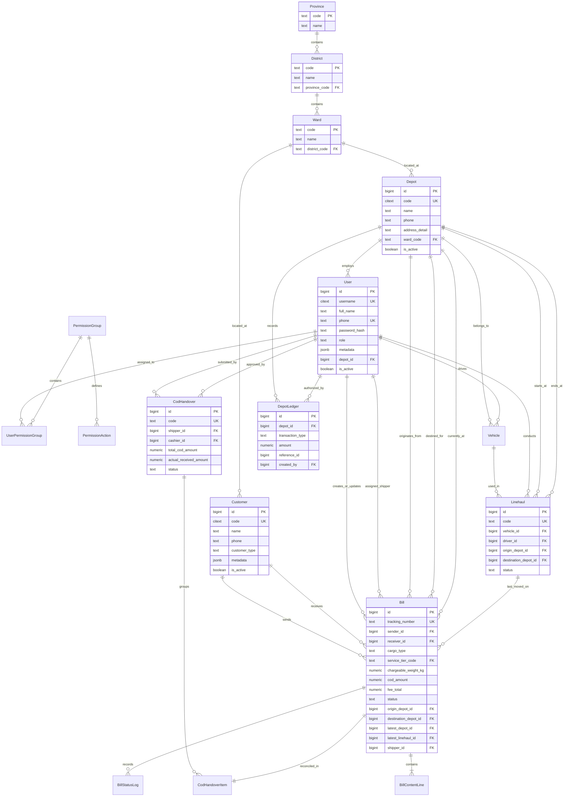
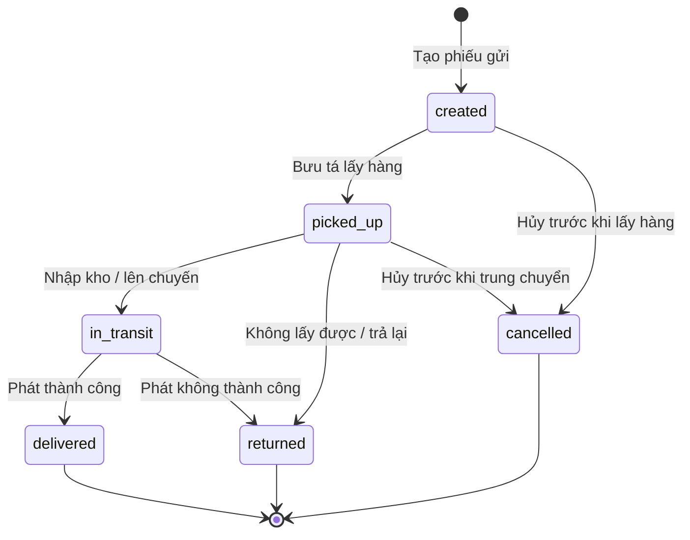

# Database Schema Design (Hoàng Nam Express)
**Dự án**: Hệ thống Quản lý Chuyển phát nhanh Hoàng Nam (Hoàng Nam Express) — Giai đoạn 1  
**Phiên bản**: 1.1  
**Ngày**: 2026-07-23  
**Tác giả**: Solution Architect Antigravity AI  
**Hệ quản trị CSDL**: PostgreSQL 16 (với các extensions `unaccent`, `pg_trgm`, `citext`)  
**Công nghệ tích hợp**: Async SQLAlchemy 2.x ORM  

Tài liệu này đặc tả chi tiết thiết kế Cơ sở dữ liệu quan hệ (Entity-Relationship Diagram - ERD) và Từ điển dữ liệu (Data Dictionary) mở rộng từ thiết kế lõi của VeloxShip để đáp ứng toàn bộ các yêu cầu nghiệp vụ của dự án Hoàng Nam - Giai đoạn 1.

---

## 0. Nhật ký cập nhật (Changelog v1.1)

Cập nhật theo `docs/note_db.md`:

1. **Đổi tên `Hub` → `Depot` (Kho hàng)** trên toàn bộ thực thể, bảng và cột (`hub_id` → `depot_id`, `current_hub_id` → `latest_depot_id`, `hub_ledgers` → `depot_ledgers`, index, ERD…).
2. Bỏ 2 bảng `departments`, `positions` và 2 cột `department_id`, `position_id` của `users`; thay bằng cột **`metadata` (JSONB)** lưu chức vụ / phòng ban / thông tin nhân sự linh hoạt.
3. Thêm cột **`role`** vào `users` để phân loại nhân sự (shipper, depot_manager, cashier, accountant…).
4. Giữ cột `hub_id` (đổi tên thành **`depot_id`**) trên `users` — cần cho vai trò `depot_manager`.
5. Bỏ toàn bộ snapshot người gửi/người nhận trên `bills`; thay bằng **`sender_id`** và **`receiver_id`** tham chiếu bảng `customers`.
6. Đổi tên thực thể `Trip` → `Linehaul`: bảng `trips` → **`linehauls`**, `trip_bags` → **`linehaul_bags`**, cột `latest_trip_id` → **`latest_linehaul_id`**.
7. `bills.current_hub_id` → **`latest_depot_id`**.
8. Thêm **`bills.latest_linehaul_id`**; **bỏ bảng `trip_bills`**.
9. *(Làm sau)* Thiết kế lại phân hệ thanh toán vận đơn (COD, chuyển khoản, công nợ).
10. Bỏ bảng `hub_service_areas` (dư thừa).
11. Bỏ 2 bảng `price_sheets`, `price_rules`. Cước phí được tính bằng **handler** dựa trên cặp `<customer_type, metadata>` của khách hàng (xem §3.5) thay vì bảng giá tĩnh.
12. `vehicles.current_hub_id` → **`latest_depot_id`**.
13. Thêm **`vehicles.latest_linehaul_id`**.
14. Bổ sung mục **State Machine vòng đời vận đơn** (§5).
15. `bill_status_logs`: bỏ cột `location`, thêm **`latest_linehaul_id`** và **`latest_depot_id`**.

---

## 1. Sơ đồ thực thể quan hệ (ERD - Mermaid Diagram)



---

## 2. Tiêu chuẩn kiểu dữ liệu dự án (Standards)
*   **Tiền tệ (Money/COD)**: Sử dụng kiểu `NUMERIC(14, 2)` nhằm lưu trữ chính xác giá trị tiền tệ VNĐ không bị sai số làm tròn (float/real).
*   **Khối lượng (Weight)**: Sử dụng kiểu `NUMERIC(12, 3)` (Đơn vị tính: **kg**), cho phép chính xác tới 3 chữ số thập phân (tương đương 1 gram).
*   **Kích thước (Dimensions)**: Sử dụng kiểu `NUMERIC(8, 2)` (Đơn vị tính: **cm**).
*   **Thời gian**: Sử dụng kiểu `TIMESTAMPTZ` (Timestamp với múi giờ), bắt buộc lưu múi giờ UTC ở database và render sang múi giờ `Asia/Ho_Chi_Minh` ở phía client.

---

## 3. Từ điển dữ liệu chi tiết các bảng (Data Dictionary)

### 3.1 Phân hệ Hành chính Địa giới (Administrative Divisions)

#### Bảng `provinces` — Tỉnh/Thành phố
*   Lưu danh mục Tỉnh/Thành phố tĩnh trên toàn quốc.

| Tên Column | Kiểu dữ liệu | Ràng buộc | Giá trị mặc định | Giải nghĩa |
| :--- | :--- | :--- | :--- | :--- |
| `code` | `TEXT` | PK | — | Mã hành chính tỉnh (ví dụ: '79') |
| `name` | `TEXT` | NOT NULL | — | Tên tỉnh/thành tiếng Việt |
| `name_en` | `TEXT` | NULL | — | Tên tiếng Anh |
| `created_at`| `TIMESTAMPTZ`| NOT NULL | `now()` | Thời gian tạo |

#### Bảng `districts` — Quận/Huyện
*   Lưu danh mục Quận/Huyện liên kết với Tỉnh/Thành phố.

| Tên Column | Kiểu dữ liệu | Ràng buộc | Giá trị mặc định | Giải nghĩa |
| :--- | :--- | :--- | :--- | :--- |
| `code` | `TEXT` | PK | — | Mã hành chính quận/huyện |
| `name` | `TEXT` | NOT NULL | — | Tên quận/huyện |
| `name_en` | `TEXT` | NULL | — | Tên tiếng Anh |
| `province_code`| `TEXT` | FK → `provinces.code` | — | Liên kết mã tỉnh |
| `created_at`| `TIMESTAMPTZ`| NOT NULL | `now()` | Thời gian tạo |

#### Bảng `wards` — Phường/Xã
*   Lưu danh mục Phường/Xã/Thị trấn trực thuộc Quận/Huyện.

| Tên Column | Kiểu dữ liệu | Ràng buộc | Giá trị mặc định | Giải nghĩa |
| :--- | :--- | :--- | :--- | :--- |
| `code` | `TEXT` | PK | — | Mã hành chính phường/xã |
| `name` | `TEXT` | NOT NULL | — | Tên phường/xã/thị trấn |
| `name_en` | `TEXT` | NULL | — | Tên tiếng Anh |
| `district_code`| `TEXT` | FK → `districts.code` | — | Liên kết mã quận/huyện |
| `created_at`| `TIMESTAMPTZ`| NOT NULL | `now()` | Thời gian tạo |

---

### 3.2 Phân hệ Kho hàng & Nhân viên (Depots & Staff)

#### Bảng `depots` — Kho hàng / Bưu cục
*   Đại diện cho các kho chứa hàng, kho trung chuyển hoặc kho tổng phục vụ giao nhận vận chuyển.

| Tên Column | Kiểu dữ liệu | Ràng buộc | Giá trị mặc định | Giải nghĩa |
| :--- | :--- | :--- | :--- | :--- |
| `id` | `BIGINT` | PK, GENERATED | — | Định danh kho hàng |
| `code` | `CITEXT` | UNIQUE, NOT NULL | — | Mã kho (ví dụ: 'KHHCM01') |
| `name` | `TEXT` | NOT NULL | — | Tên kho hàng |
| `phone` | `TEXT` | NOT NULL | — | Số điện thoại kho |
| `address_detail`| `TEXT` | NOT NULL | — | Số nhà, tên đường |
| `ward_code` | `TEXT` | FK → `wards.code` | — | Liên kết địa giới Phường/Xã |
| `is_active` | `BOOLEAN` | NOT NULL | `true` | Trạng thái hoạt động |
| `created_at` | `TIMESTAMPTZ`| NOT NULL | `now()` | Thời gian tạo |
| `updated_at` | `TIMESTAMPTZ`| NOT NULL | `now()` | Thời gian chỉnh sửa |

#### Bảng `users` — Tài khoản Nhân viên (Cập nhật)
*   Mở rộng bảng `users` để quản lý vai trò, kho làm việc trực tiếp và thông tin nhân sự linh hoạt qua `metadata`.

| Tên Column | Kiểu dữ liệu | Ràng buộc | Giá trị mặc định | Giải nghĩa |
| :--- | :--- | :--- | :--- | :--- |
| `id` | `BIGINT` | PK, GENERATED | — | Định danh nhân viên |
| `username` | `CITEXT` | UNIQUE, NOT NULL | — | Tên đăng nhập |
| `full_name` | `TEXT` | NOT NULL | — | Họ và tên |
| `phone` | `TEXT` | UNIQUE, NOT NULL | — | Số điện thoại nhân viên |
| `password_hash`| `TEXT` | NOT NULL | — | Mật khẩu băm (bcrypt) |
| `role` | `TEXT` | CHECK IN ('shipper', 'depot_manager', 'cashier', 'accountant', 'operator', 'admin') | — | Phân loại vai trò nhân sự |
| `metadata` | `JSONB` | NULL | — | Thông tin nhân sự linh hoạt: chức vụ, phòng ban, ghi chú… |
| `depot_id` | `BIGINT` | FK → `depots.id` (NULL) | `NULL` | Kho làm việc trực tiếp (bắt buộc với `depot_manager`) |
| `is_active` | `BOOLEAN` | NOT NULL | `true` | Trạng thái hoạt động |
| `created_at` | `TIMESTAMPTZ`| NOT NULL | `now()` | Thời gian tạo |
| `updated_at` | `TIMESTAMPTZ`| NOT NULL | `now()` | Thời gian chỉnh sửa |

*   *Ghi chú*: `role` là danh mục mở, có thể bổ sung giá trị mới. Thông tin tổ chức chi tiết (phòng ban, chức vụ cụ thể) lưu trong `metadata` thay vì bảng riêng — ví dụ:
    ```json
    { "department": "Vận hành", "position": "Thủ kho", "employee_code": "NV0123" }
    ```

---

### 3.3 Phân hệ Phân Quyền Hệ Thống (Authorization)

*   `role` (§3.2) dùng phân loại vai trò tổng quát; các bảng dưới đây cấp quyền chi tiết theo hành động khi cần.

#### Bảng `permission_groups` — Nhóm quyền / Vai trò
| Tên Column | Kiểu dữ liệu | Ràng buộc | Giá trị mặc định | Giải nghĩa |
| :--- | :--- | :--- | :--- | :--- |
| `id` | `BIGINT` | PK, GENERATED | — | Định danh nhóm quyền |
| `name` | `TEXT` | UNIQUE, NOT NULL | — | Tên nhóm quyền (ví dụ: 'Kế toán kho') |
| `description`| `TEXT` | NULL | — | Mô tả |

#### Bảng `user_permission_groups` — Bảng gán nhóm quyền cho nhân viên
| Tên Column | Kiểu dữ liệu | Ràng buộc | Giá trị mặc định | Giải nghĩa |
| :--- | :--- | :--- | :--- | :--- |
| `user_id` | `BIGINT` | PK, FK → `users.id` (CASCADE) | — | Định danh nhân viên |
| `group_id` | `BIGINT` | PK, FK → `permission_groups.id` (CASCADE) | — | Định danh nhóm quyền |

#### Bảng `permission_actions` — Hành động chi tiết được phân quyền
| Tên Column | Kiểu dữ liệu | Ràng buộc | Giá trị mặc định | Giải nghĩa |
| :--- | :--- | :--- | :--- | :--- |
| `group_id` | `BIGINT` | PK, FK → `permission_groups.id` (CASCADE) | — | Liên kết nhóm quyền |
| `action` | `TEXT` | PK | — | Ký hiệu quyền (ví dụ: 'bill:create') |

---

### 3.4 Đội Xe & Chuyến Xe Trung Chuyển (Fleet & Linehauls)

#### Bảng `vehicles` — Đội xe kho hàng
*   Quản lý thông tin xe tải trung chuyển hoặc xe máy bưu tá giao hàng.

| Tên Column | Kiểu dữ liệu | Ràng buộc | Giá trị mặc định | Giải nghĩa |
| :--- | :--- | :--- | :--- | :--- |
| `id` | `BIGINT` | PK, GENERATED | — | Định danh xe |
| `license_plate`| `TEXT` | UNIQUE, NOT NULL | — | Biển số xe (ví dụ: '29C-123.45') |
| `vehicle_type` | `TEXT` | CHECK IN ('motorcycle', 'truck') | — | Loại xe tải/xe máy |
| `max_weight_kg`| `NUMERIC(12,3)`| NOT NULL | — | Khối lượng tải tối đa |
| `max_volume_m3`| `NUMERIC(8,2)` | NOT NULL | — | Thể tích thùng xe tối đa |
| `latest_depot_id`| `BIGINT`| FK → `depots.id` (NULL) | — | Kho quản lý xe gần nhất |
| `latest_linehaul_id`| `BIGINT`| FK → `linehauls.id` (NULL) | `NULL` | Chuyến linehaul gần nhất xe tham gia |
| `driver_id` | `BIGINT` | FK → `users.id` (NULL) | `NULL` | Tài xế phụ trách mặc định |
| `status` | `TEXT` | CHECK IN ('active', 'inactive', 'maintenance') | 'active' | Trạng thái hoạt động của xe |
| `created_at` | `TIMESTAMPTZ`| NOT NULL | `now()` | Thời gian tạo |
| `updated_at` | `TIMESTAMPTZ`| NOT NULL | `now()` | Thời gian chỉnh sửa |

#### Bảng `linehauls` — Chuyến xe trung chuyển (tuyến depot→depot)
*   Lịch trình xe tải chuyển hàng trung chuyển giữa các kho chi nhánh/kho tổng; quản lý thông tin giao vận theo tuyến từ kho này đến kho kia.

| Tên Column | Kiểu dữ liệu | Ràng buộc | Giá trị mặc định | Giải nghĩa |
| :--- | :--- | :--- | :--- | :--- |
| `id` | `BIGINT` | PK, GENERATED | — | Định danh chuyến xe |
| `code` | `TEXT` | UNIQUE, NOT NULL | — | Mã chuyến xe duy nhất |
| `vehicle_id` | `BIGINT` | FK → `vehicles.id` | — | Xe tải sử dụng |
| `driver_id` | `BIGINT` | FK → `users.id` | — | Tài xế điều khiển |
| `origin_depot_id`| `BIGINT`| FK → `depots.id` | — | Kho xuất phát |
| `destination_depot_id`| `BIGINT`| FK → `depots.id`| — | Kho đích đến |
| `status` | `TEXT` | CHECK IN ('scheduled', 'loading', 'in_transit', 'arrived', 'completed') | 'scheduled' | Trạng thái hành trình của chuyến xe |
| `start_odometer`| `INTEGER`| NULL | — | Số công-tơ-mét khi xuất bến |
| `end_odometer` | `INTEGER`| NULL | — | Số công-tơ-mét khi đến bến |
| `created_at` | `TIMESTAMPTZ`| NOT NULL | `now()` | Thời gian tạo |
| `updated_at` | `TIMESTAMPTZ`| NOT NULL | `now()` | Thời gian chỉnh sửa |

*   *Ghi chú*: Vận đơn không còn bảng nối `trip_bills`; mỗi vận đơn lưu trực tiếp `latest_linehaul_id` trỏ tới chuyến (linehaul) gần nhất chở nó (xem §3.7).

---

### 3.5 Khách hàng (Customers)

*   Bảng master khách hàng (dùng cho cả người gửi và người nhận). Giữ **tối giản** ở giai đoạn này trước khi chốt use case; thông tin mở rộng lưu linh hoạt trong `metadata`. Cột `customer_type` quyết định **handler tính cước** áp dụng cho đơn hàng của khách.

#### Bảng `customers` — Khách hàng

| Tên Column | Kiểu dữ liệu | Ràng buộc | Giá trị mặc định | Giải nghĩa |
| :--- | :--- | :--- | :--- | :--- |
| `id` | `BIGINT` | PK, GENERATED | — | Định danh khách hàng |
| `code` | `CITEXT` | UNIQUE, NULL | — | Mã khách hàng (in "Mã KH" trên phiếu); NULL nếu khách vãng lai chưa cấp mã |
| `name` | `TEXT` | NOT NULL | — | Tên khách hàng (cá nhân hoặc doanh nghiệp) |
| `phone` | `TEXT` | NULL | — | Số điện thoại liên hệ chính |
| `customer_type` | `TEXT` | NOT NULL, CHECK IN ('retail', 'shop', 'enterprise') | 'retail' | Loại khách hàng — **quyết định handler tính cước** |
| `metadata` | `JSONB` | NULL | — | Dữ liệu mở rộng phục vụ tính cước & hồ sơ (địa chỉ, mã số thuế, chiết khấu, tham số hợp đồng…) |
| `is_active` | `BOOLEAN` | NOT NULL | `true` | Trạng thái hoạt động |
| `created_at` | `TIMESTAMPTZ`| NOT NULL | `now()` | Thời gian tạo |
| `updated_at` | `TIMESTAMPTZ`| NOT NULL | `now()` | Thời gian chỉnh sửa |

*   **Chiến lược tính cước (Pricing strategy)**: Hệ thống **không dùng bảng giá tĩnh** (`price_sheets`/`price_rules` đã bỏ). Thay vào đó, xây dựng các **handler tính cước** nhận đầu vào là cặp `<customer_type, metadata>`; `customer_type` quyết định handler nào được chọn, còn `metadata` cung cấp tham số đầu vào cho công thức tính:
    *   `retail` → `RetailPriceHandler` — giá cước niêm yết công khai.
    *   `shop` → `ShopPriceHandler` — áp dụng chiết khấu/tham số nhóm shop lấy từ `metadata`.
    *   `enterprise` → `ContractPriceHandler` — áp dụng giá hợp đồng riêng theo tham số trong `metadata`.
*   **`metadata`** là đầu vào linh hoạt cho handler tính cước, ví dụ:
    ```json
    {
      "address_detail": "12 Lê Lợi",
      "ward_code": "26734",
      "tax_code": "0301234567",
      "default_discount_rate": 0.05,
      "base_rate_table": "STD_2026",
      "cod_fee_rate": 0.01
    }
    ```
*   *Ghi chú*: Danh mục `customer_type` là mở — bổ sung loại mới chỉ cần thêm một handler tương ứng, không cần thay đổi schema. Các cột chi tiết (địa chỉ, phường/xã…) sẽ được tách ra khỏi `metadata` thành cột riêng khi use case được chốt.

---

### 3.6 Đối Tác Vận Chuyển Ngoài (3PL Partners)

#### Bảng `partners` — Đối tác 3PL liên kết
| Tên Column | Kiểu dữ liệu | Ràng buộc | Giá trị mặc định | Giải nghĩa |
| :--- | :--- | :--- | :--- | :--- |
| `id` | `BIGINT` | PK, GENERATED | — | Định danh đối tác |
| `code` | `CITEXT` | UNIQUE, NOT NULL | — | Mã đối tác (GHN, GHTK...) |
| `name` | `TEXT` | NOT NULL | — | Tên đối tác vận chuyển |
| `api_url` | `TEXT` | NOT NULL | — | Endpoint API kết nối |
| `api_token` | `TEXT` | NOT NULL | — | Token xác thực kết nối |
| `is_active` | `BOOLEAN` | NOT NULL | `true` | Trạng thái kết nối |
| `created_at` | `TIMESTAMPTZ`| NOT NULL | `now()` | Thời gian tạo |
| `updated_at` | `TIMESTAMPTZ`| NOT NULL | `now()` | Thời gian chỉnh sửa |

#### Bảng `partner_tariffs` — Giá cước mua 3PL
*   Lưu biểu phí mua cước của đối tác 3PL để làm căn cứ tính giá vốn dịch vụ.

| Tên Column | Kiểu dữ liệu | Ràng buộc | Giá trị mặc định | Giải nghĩa |
| :--- | :--- | :--- | :--- | :--- |
| `id` | `BIGINT` | PK, GENERATED | — | Định danh dòng cước mua |
| `partner_id` | `BIGINT` | FK → `partners.id` (CASCADE) | — | Đối tác 3PL tương ứng |
| `service_name` | `TEXT` | NOT NULL | — | Tên gói dịch vụ đối tác cung cấp |
| `route_type` | `TEXT` | NOT NULL | — | Vùng tuyến (nội tỉnh, liên vùng...) |
| `base_fee` | `NUMERIC(14,2)`| NOT NULL, CHECK ≥ 0 | 0.00 | Đơn giá cước mua nền |

---

### 3.7 Vận Đơn & Kho Trung Chuyển (Bills & Warehousing)

#### Bảng `bills` — Vận đơn / Phiếu gửi (Cập nhật)
*   Thông tin người gửi/người nhận tham chiếu trực tiếp tới bảng `customers` qua `sender_id` / `receiver_id` (không còn snapshot).

| Tên Column | Kiểu dữ liệu | Ràng buộc | Giá trị mặc định | Giải nghĩa |
| :--- | :--- | :--- | :--- | :--- |
| `id` | `BIGINT` | PK, GENERATED | — | Định danh vận đơn |
| `tracking_number`| `TEXT` | UNIQUE, NOT NULL | — | Mã vận đơn duy nhất |
| `sender_id` | `BIGINT` | FK → `customers.id`, NOT NULL | — | Khách hàng gửi (tham chiếu) |
| `receiver_id` | `BIGINT` | FK → `customers.id`, NOT NULL | — | Khách hàng nhận (tham chiếu) |
| **Cargo Details** | | | | |
| `cargo_type` | `TEXT` | CHECK IN ('document', 'goods')| — | Phân loại Tài liệu / Hàng hóa |
| `service_tier_code`| `TEXT`| FK → `service_tiers.code` | — | Gói dịch vụ chính sử dụng |
| `actual_weight_kg`| `NUMERIC(12,3)`| NOT NULL, CHECK ≥ 0 | — | Cân nặng thực tế đo tại quầy |
| `chargeable_weight_kg`| `NUMERIC(12,3)`| NOT NULL, CHECK ≥ 0 | — | Cân nặng tính cước sau quy đổi |
| `is_insurance_required`| `BOOLEAN`| NOT NULL | `false` | Có mua bảo hiểm hàng hóa không |
| `cod_amount` | `NUMERIC(14,2)`| NOT NULL, CHECK ≥ 0 | 0.00 | Số tiền thu hộ COD (VNĐ) |
| **Fees Details** | | | | |
| `fee_main` | `NUMERIC(14,2)`| NOT NULL, CHECK ≥ 0 | 0.00 | Cước chính vận chuyển |
| `fee_insurance`| `NUMERIC(14,2)`| NOT NULL, CHECK ≥ 0 | 0.00 | Phí bảo hiểm hàng hóa |
| `fee_other` | `NUMERIC(14,2)`| NOT NULL, CHECK ≥ 0 | 0.00 | Các phụ phí khác (vượt khổ...) |
| `fee_vat` | `NUMERIC(14,2)`| NOT NULL, CHECK ≥ 0 | 0.00 | Thuế VAT |
| `fee_total` | `NUMERIC(14,2)`| NOT NULL, CHECK ≥ 0 | — | Tổng cước thực tế của đơn hàng |
| `payer` | `TEXT` | CHECK IN ('sender', 'receiver')| — | Bên chịu trách nhiệm thanh toán cước |
| **Routing & Staff** | | | | |
| `origin_depot_id`| `BIGINT` | FK → `depots.id` | — | Kho tiếp nhận đơn đầu |
| `destination_depot_id`| `BIGINT`| FK → `depots.id` | — | Kho phát hàng chặng cuối |
| `latest_depot_id`| `BIGINT` | FK → `depots.id` (NULL) | — | Kho đơn đang nằm gần nhất |
| `latest_linehaul_id`| `BIGINT` | FK → `linehauls.id` (NULL) | `NULL` | Chuyến xe gần nhất chở đơn |
| `shipper_id` | `BIGINT` | FK → `users.id` (NULL) | `NULL` | Bưu tá được gán đi lấy/đi giao |
| `partner_id` | `BIGINT` | FK → `partners.id` (NULL) | `NULL` | Đối tác 3PL trung chuyển (nếu có) |
| `partner_bill_code`| `TEXT` | NULL | — | Mã vận đơn của đối tác 3PL ngoài |
| **Lifecycle** | | | | |
| `status` | `TEXT` | CHECK IN ('created', 'picked_up', 'in_transit', 'delivered', 'returned', 'cancelled') | 'created' | Trạng thái hành trình đơn hàng |
| `delivered_at` | `TIMESTAMPTZ`| NULL | — | Thời gian phát thành công |
| `delivered_to_name`| `TEXT` | NULL | — | Họ tên người ký nhận đơn hàng |
| `cancellation_reason`| `TEXT` | NULL | — | Lý do hủy đơn hàng |
| `created_by` | `BIGINT` | FK → `users.id` | — | Tài khoản nhân viên tạo đơn |
| `created_at` | `TIMESTAMPTZ`| NOT NULL | `now()` | Thời gian tiếp nhận đơn |
| `updated_by` | `BIGINT` | FK → `users.id` | — | Nhân sự cập nhật đơn cuối |
| `updated_at` | `TIMESTAMPTZ`| NOT NULL | `now()` | Thời gian chỉnh sửa cuối |
| `print_count` | `INTEGER` | NOT NULL | 0 | Số lần in phiếu gửi |

*   *Ràng buộc cước phí*: `CHECK (fee_total = fee_main + fee_insurance + fee_other + fee_vat)`.
*   *Ràng buộc trạng thái*: 
    *   `CHECK (status <> 'cancelled' OR cancellation_reason IS NOT NULL)` (Khi hủy bắt buộc nhập lý do).
    *   `CHECK (status <> 'delivered' OR (delivered_at IS NOT NULL AND delivered_to_name IS NOT NULL))` (Khi phát thành công bắt buộc cập nhật thời gian phát và tên người nhận ký).
*   *Ghi chú tham chiếu khách hàng*: Do bỏ snapshot, **mọi người gửi và người nhận đều phải tồn tại là bản ghi trong `customers`** (khách vãng lai cũng cần tạo hồ sơ). Mã KH ("Mã KH") và thông tin tên/địa chỉ khi in phiếu lấy từ `customers` qua JOIN. Đánh đổi: vận đơn **không còn bất biến lịch sử** — sửa hồ sơ khách hàng sẽ ảnh hưởng dữ liệu hiển thị của các vận đơn cũ (khác với ràng buộc snapshot FR-020 của bản lõi VeloxShip).

#### Bảng `bill_content_lines` — Chi tiết hàng hóa trong vận đơn
*   Lưu thông tin chi tiết từng mặt hàng/dòng nội dung trong gói hàng của vận đơn.

| Tên Column | Kiểu dữ liệu | Ràng buộc | Giá trị mặc định | Giải nghĩa |
| :--- | :--- | :--- | :--- | :--- |
| `id` | `BIGINT` | PK, GENERATED | — | Định danh dòng nội dung |
| `bill_id` | `BIGINT` | FK → `bills.id` (CASCADE) | — | Liên kết vận đơn |
| `line_no` | `INTEGER` | NOT NULL | — | Số thứ tự dòng của hàng hóa (1, 2, 3...) |
| `description` | `TEXT` | NOT NULL | — | Mô tả hàng hóa |
| `quantity` | `INTEGER` | NOT NULL, CHECK > 0 | — | Số lượng hàng hóa |
| `weight_kg` | `NUMERIC(12,3)`| NOT NULL, CHECK ≥ 0 | — | Khối lượng của dòng hàng (kg) |
| `length_cm` | `NUMERIC(8,2)` | NULL, CHECK ≥ 0 | — | Chiều dài gói hàng (cm) |
| `width_cm` | `NUMERIC(8,2)` | NULL, CHECK ≥ 0 | — | Chiều rộng gói hàng (cm) |
| `height_cm` | `NUMERIC(8,2)` | NULL, CHECK ≥ 0 | — | Chiều cao gói hàng (cm) |

*   *Ràng buộc*: `UNIQUE (bill_id, line_no)` để tránh trùng lặp số dòng nội dung trên cùng một vận đơn.

#### Bảng `bill_status_logs` — Lịch sử hành trình / Audit Log
*   Ghi nhận chi tiết từng bước chuyển trạng thái và lịch sử cập nhật vận đơn để đối chiếu.

| Tên Column | Kiểu dữ liệu | Ràng buộc | Giá trị mặc định | Giải nghĩa |
| :--- | :--- | :--- | :--- | :--- |
| `id` | `BIGINT` | PK, GENERATED | — | Định danh log |
| `bill_id` | `BIGINT` | FK → `bills.id` (CASCADE) | — | Vận đơn tương ứng |
| `from_status` | `TEXT` | NULL | — | Trạng thái trước khi đổi |
| `to_status` | `TEXT` | NOT NULL | — | Trạng thái mới cập nhật |
| `note` | `TEXT` | NULL | — | Ghi chú lý do thay đổi / Lý do rollback |
| `latest_linehaul_id`| `BIGINT` | FK → `linehauls.id` (NULL) | — | Chuyến xe gắn với mốc cập nhật (nếu có) |
| `latest_depot_id`| `BIGINT`| FK → `depots.id` (NULL) | — | Kho gắn với mốc cập nhật (nếu có) |
| `changed_by` | `BIGINT` | FK → `users.id` | — | Nhân viên thực hiện cập nhật |
| `created_at` | `TIMESTAMPTZ`| NOT NULL | `now()` | Thời gian ghi nhận mốc |

*   *Ghi chú*: Vị trí mốc quét được biểu diễn bằng `latest_depot_id` (đơn đang ở kho) hoặc `latest_linehaul_id` (đơn đang trên chuyến xe) thay cho cột `location` dạng text tự do trước đây.

---

### 3.8 Phân hệ Quản Lý Tiền Mặt COD (COD Handover & Ledgers)

> ⚠️ **Chờ thiết kế lại (note #9)**: Toàn bộ phân hệ thanh toán vận đơn (COD, chuyển khoản, công nợ) sẽ được thiết kế lại thành mô hình giao dịch (transaction) thống nhất ở phiên bản sau. Các bảng dưới đây giữ tạm cho luồng COD tiền mặt Giai đoạn 1.

#### Bảng `cod_handovers` — Bảng kê bàn giao tiền mặt COD của bưu tá
*   Lưu thông tin bảng kê bàn giao tiền mặt nộp quỹ kho của bưu tá cuối ca.

| Tên Column | Kiểu dữ liệu | Ràng buộc | Giá trị mặc định | Giải nghĩa |
| :--- | :--- | :--- | :--- | :--- |
| `id` | `BIGINT` | PK, GENERATED | — | Định danh bảng kê |
| `code` | `TEXT` | UNIQUE, NOT NULL | — | Mã bảng kê nộp tiền (ví dụ: 'COD12345') |
| `shipper_id` | `BIGINT` | FK → `users.id` | — | Bưu tá nộp tiền |
| `cashier_id` | `BIGINT` | FK → `users.id` (NULL) | `NULL` | Thủ quỹ nhận và đối soát |
| `total_cod_amount`| `NUMERIC(14,2)`| NOT NULL, CHECK ≥ 0 | — | Tổng tiền COD bưu tá khai báo nộp |
| `actual_received_amount`| `NUMERIC(14,2)`| NULL, CHECK ≥ 0 | — | Tiền mặt thủ quỹ thực đếm nhận |
| `status` | `TEXT` | CHECK IN ('pending', 'approved', 'rejected') | 'pending' | Trạng thái duyệt của bảng kê |
| `rejection_reason`| `TEXT` | NULL | — | Lý do từ chối (nếu lệch tiền mặt) |
| `created_at` | `TIMESTAMPTZ`| NOT NULL | `now()` | Thời gian lập bảng kê |
| `updated_at` | `TIMESTAMPTZ`| NOT NULL | `now()` | Thời gian phê duyệt |

#### Bảng `cod_handover_items` — Chi tiết vận đơn nằm trong bảng kê nộp tiền
| Tên Column | Kiểu dữ liệu | Ràng buộc | Giá trị mặc định | Giải nghĩa |
| :--- | :--- | :--- | :--- | :--- |
| `handover_id` | `BIGINT` | PK, FK → `cod_handovers.id` (CASCADE) | — | Bảng kê nộp tiền |
| `bill_id` | `BIGINT` | PK, UNIQUE, FK → `bills.id` (CASCADE) | — | Vận đơn nộp tiền COD |

*   *Ràng buộc*: `bill_id` là UNIQUE để loại bỏ hoàn toàn việc bưu tá gán trùng 1 vận đơn đã giao vào 2 bảng kê nộp tiền khác nhau.

#### Bảng `depot_ledgers` — Sổ quỹ dòng tiền mặt kho hàng
*   Ghi nhận toàn bộ dòng tiền mặt biến động thực tế chạy qua két sắt của kho.

| Tên Column         | Kiểu dữ liệu    | Ràng buộc                                                                             | Giá trị mặc định | Giải nghĩa                                 |
| :----------------- | :-------------- | :------------------------------------------------------------------------------------ | :--------------- | :----------------------------------------- |
| `id`               | `BIGINT`        | PK, GENERATED                                                                         | —                | Định danh giao dịch quỹ                    |
| `depot_id`         | `BIGINT`        | FK → `depots.id`                                                                      | —                | Kho ghi nhận biến động quỹ                 |
| `transaction_type` | `TEXT`          | CHECK IN ('cod_collection', 'cod_payout', 'shipper_remittance', 'deposit', 'expense') | —                | Phân loại thu chi quỹ                      |
| `amount`           | `NUMERIC(14,2)` | NOT NULL                                                                              | —                | Giá trị giao dịch (Dương: Thu, Âm: Chi)    |
| `reference_id`     | `BIGINT`        | NULL                                                                                  | —                | ID bảng kê COD hoặc ID phiếu chi liên quan |
| `created_by`       | `BIGINT`        | FK → `users.id`                                                                       | —                | Thủ quỹ / Kế toán tạo giao dịch            |
| `created_at`       | `TIMESTAMPTZ`   | NOT NULL                                                                              | `now()`          | Thời gian giao dịch quỹ                    |

---

## 4. Thiết kế Index hiệu năng hệ thống (Indexes)

Để đảm bảo hiệu năng tìm kiếm dưới 1 giây cho cơ sở dữ liệu trên 100.000 vận đơn:
1.  **Tìm kiếm theo tên/SĐT người gửi–người nhận**: Do vận đơn tham chiếu `sender_id`/`receiver_id`, việc tìm kiếm không dấu theo tên/số điện thoại được thực hiện trên bảng `customers` (index `unaccent` + `pg_trgm` trên `customers.display_name`, `customers.phone` — xem tài liệu lõi VeloxShip), rồi JOIN về `bills`.
    ```sql
    CREATE EXTENSION IF NOT EXISTS unaccent;
    CREATE EXTENSION IF NOT EXISTS pg_trgm;
    ```
2.  **Index lọc trạng thái hành trình bưu gửi**:
    ```sql
    CREATE INDEX idx_bills_status_created_at 
    ON bills (status, created_at DESC);
    ```
3.  **Index các khóa ngoại thường xuyên JOIN**:
    ```sql
    CREATE INDEX idx_bills_sender ON bills (sender_id);
    CREATE INDEX idx_bills_receiver ON bills (receiver_id);
    CREATE INDEX idx_bills_latest_depot ON bills (latest_depot_id);
    CREATE INDEX idx_bills_latest_linehaul ON bills (latest_linehaul_id);
    CREATE INDEX idx_bills_shipper ON bills (shipper_id);
    ```
4.  **Index duy nhất chống nhập trùng**:
    *   Tự động được tạo bởi các thuộc tính `UNIQUE` đối với: `bills.tracking_number`, `cod_handovers.code`, `cod_handover_items.bill_id`, `vehicles.license_plate`, `users.phone`, `depots.code`.

---

## 5. Vòng đời vận đơn (Bill State Machine)

Sơ đồ dưới minh họa vòng đời trạng thái của một vận đơn (`bills.status`), khớp với ràng buộc `CHECK` và logic xử lý ở tầng service.



**Bảng chuyển trạng thái hợp lệ** (kiểm soát trong `bill_service`):

| Từ trạng thái | Được phép chuyển sang | Ý nghĩa |
| :--- | :--- | :--- |
| `created` | `picked_up`, `cancelled` | Đã tạo phiếu gửi |
| `picked_up` | `in_transit`, `returned`, `cancelled` | Đã lấy hàng |
| `in_transit` | `delivered`, `returned` | Đang vận chuyển |
| `delivered` | *(kết thúc)* | Đã giao thành công |
| `returned` | *(kết thúc)* | Hoàn trả |
| `cancelled` | *(kết thúc)* | Đã hủy |

**Ràng buộc chuyển trạng thái**:
*   Chuyển sang `delivered` bắt buộc có `delivered_at` (server tự set `now()` nếu thiếu) và `delivered_to_name`.
*   Chuyển sang `cancelled` bắt buộc có `cancellation_reason` khác rỗng.
*   Không cho `cancelled` khi đơn đã ở trạng thái `in_transit` trở đi.
*   Mỗi lần chuyển trạng thái ghi 1 dòng vào `bill_status_logs` (kèm `latest_depot_id`/`latest_linehaul_id` vị trí mốc quét).

---
---

# Giai đoạn 2 (Deferred Tables)

#### Bảng `bags` — Bao hàng trung chuyển bưu chính
*   Đại diện cho các bao tải lớn dùng để gom đơn trung chuyển.

| Tên Column | Kiểu dữ liệu | Ràng buộc | Giá trị mặc định | Giải nghĩa |
| :--- | :--- | :--- | :--- | :--- |
| `id` | `BIGINT` | PK, GENERATED | — | Định danh bao hàng |
| `code` | `TEXT` | UNIQUE, NOT NULL | — | Mã bao hàng tải (ví dụ: 'BAG123456') |
| `origin_depot_id`| `BIGINT`| FK → `depots.id` | — | Kho thực hiện đóng bao |
| `destination_depot_id`| `BIGINT`| FK → `depots.id`| — | Kho đích nhận bao |
| `status` | `TEXT` | CHECK IN ('open', 'sealed', 'in_transit', 'received', 'unpacked') | 'open' | Trạng thái niêm phong bao hàng |
| `created_at` | `TIMESTAMPTZ`| NOT NULL | `now()` | Thời gian tạo bao |
| `updated_at` | `TIMESTAMPTZ`| NOT NULL | `now()` | Lần cuối cập nhật bao |

#### Bảng `bag_items` — Chi tiết vận đơn lẻ nằm trong bao trung chuyển
| Tên Column | Kiểu dữ liệu | Ràng buộc | Giá trị mặc định | Giải nghĩa |
| :--- | :--- | :--- | :--- | :--- |
| `bag_id` | `BIGINT` | PK, FK → `bags.id` (CASCADE) | — | Bao hàng lớn |
| `bill_id` | `BIGINT` | PK, UNIQUE, FK → `bills.id` (CASCADE)| — | Vận đơn lẻ |

*   *Ràng buộc*: `bill_id` là UNIQUE để đảm bảo một vận đơn lẻ chỉ được xếp vào duy nhất 1 bao hàng trung chuyển chưa mở tại một thời điểm.

#### Bảng `linehaul_bags` — Bao hàng bốc xếp lên chuyến xe tải
| Tên Column | Kiểu dữ liệu | Ràng buộc | Giá trị mặc định | Giải nghĩa |
| :--- | :--- | :--- | :--- | :--- |
| `linehaul_id` | `BIGINT` | PK, FK → `linehauls.id` (CASCADE) | — | Chuyến xe tải trung chuyển |
| `bag_id` | `BIGINT` | PK, UNIQUE, FK → `bags.id` (CASCADE) | — | Bao trung chuyển |

*   *Ràng buộc*: `bag_id` là UNIQUE để đảm bảo một bao hàng trung chuyển chỉ được xếp lên duy nhất 1 chuyến xe tải đang vận hành.
