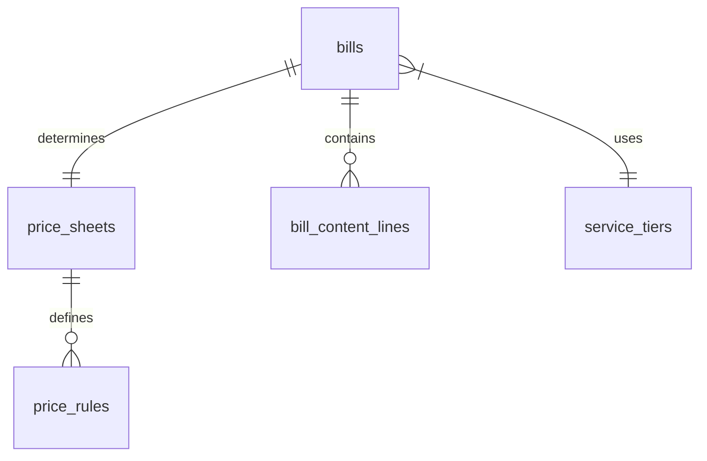

# Công Thức Tính Cước Vận Chuyển (Hoàng Nam Express)
**Dự án**: Hệ thống Quản lý Chuyển phát nhanh Hoàng Nam (Hoàng Nam Express) — Giai đoạn 1  
**Phiên bản**: 1.0  
**Ngày**: 2026-07-21  
**Tác giả**: Solution Architect Antigravity AI  

Tài liệu này đặc tả chi tiết **Công thức tính cước phí vận chuyển** và các phụ phí đi kèm trong hệ thống Hoàng Nam Express - Giai đoạn 1. Công thức này được ánh xạ trực tiếp từ thiết kế cơ sở dữ liệu quan hệ mô tả trong tài liệu [hoang-nam-db.md](file:///Users/khoale/WORKING/veloxship/docs_wiki/raw/assets/hoang-nam-db/hoang-nam-db.md).

---

## 1. Các bảng dữ liệu liên quan (Database Schema Context)

Công thức tính cước sử dụng dữ liệu từ các thực thể chính sau:



### 1.1. Bảng giá (`price_sheets`) và Quy tắc cước (`price_rules`)
*   **`price_sheets`**: Lưu trữ bảng giá cước đang hiệu lực (`is_active = true`). Một bảng giá có thể được gán riêng biệt cho một khách hàng lớn (`customer_id`) hoặc áp dụng cho cả nhóm đối tượng khách hàng (`customer_group` ∈ `'retail'`, `'shop'`, `'enterprise'`).
*   **`price_rules`**: Quy định chi tiết các tham số tính cước cho từng gói dịch vụ (`service_tier_code`) và loại tuyến đường (`route_type`):
    *   `max_weight_kg` ($W_{max}$): Trọng lượng tối đa được hưởng giá cước nền.
    *   `base_fee` ($F_{base}$): Đơn giá cước nền (VNĐ).
    *   `step_weight_kg` ($W_{step}$): Trọng lượng của mỗi bước cộng thêm vượt định mức (kg).
    *   `step_fee` ($F_{step}$): Đơn giá cước cộng thêm cho mỗi bước cân (VNĐ).

### 1.2. Vận đơn (`bills`) và Chi tiết hàng hóa (`bill_content_lines`)
*   **`bills`**:
    *   `sender_ward_code` & `receiver_ward_code`: Dùng để xác định loại tuyến đường (`route_type`).
    *   `chargeable_weight_kg` ($W_{charge}$): Trọng lượng tính cước của đơn hàng sau quy đổi (kg).
    *   `is_insurance_required`: Trạng thái yêu cầu mua bảo hiểm hàng hóa.
    *   `cod_amount` / `cargo_value`: Dùng để làm căn cứ tính phí bảo hiểm.
*   **`bill_content_lines`**:
    *   `weight_kg`, `length_cm`, `width_cm`, `height_cm`: Dùng để tính toán ra trọng lượng tính cước sau quy đổi ($W_{charge}$) của vận đơn.

---

## 2. Quy trình tính toán 6 bước (Step-by-Step Calculation)

### Bước 1: Xác định Bảng giá áp dụng (`PriceSheet`)
Hệ thống xác định bảng giá có hiệu lực (`is_active = true`) dựa theo mức độ ưu tiên:
1.  **Ưu tiên 1 (Khách hàng đặc thù)**: Tìm bảng giá có `customer_id` bằng với `bill.customer_id`.
2.  **Ưu tiên 2 (Nhóm khách hàng)**: Nếu không có bảng giá riêng, tìm bảng giá có `customer_group` khớp với nhóm của khách hàng đó (ví dụ: Shop VIP, Doanh nghiệp lớn).
3.  **Ưu tiên 3 (Khách lẻ)**: Nếu là khách vãng lai không có tài khoản, áp dụng bảng giá có `customer_group = 'retail'`.

### Bước 2: Xác định Loại tuyến đường (`route_type`)
Dựa trên `sender_ward_code` và `receiver_ward_code`, hệ thống sẽ truy vấn danh mục địa giới hành chính (`wards` $\rightarrow$ `districts` $\rightarrow$ `provinces`) để đối chiếu:
*   **Nội tỉnh (`intra_province`)**: Tỉnh/Thành phố của người gửi trùng với Tỉnh/Thành phố của người nhận.
*   **Nội vùng (`intra_region`)**: Khác Tỉnh/Thành phố nhưng cùng chung một phân vùng miền (Miền Bắc, Miền Trung, hoặc Miền Nam).
*   **Liên vùng (`inter_region`)**: Tỉnh/Thành phố của người gửi và người nhận nằm ở hai miền khác nhau.

### Bước 3: Tìm Quy tắc cước phù hợp (`PriceRule`)
Sau khi xác định được `price_sheet_id` (Bước 1) và `route_type` (Bước 2), hệ thống tra cứu bảng `price_rules` để lấy quy tắc tương ứng với gói dịch vụ của vận đơn (`bill.service_tier_code`):
```sql
SELECT max_weight_kg, base_fee, step_weight_kg, step_fee 
FROM price_rules 
WHERE price_sheet_id = :price_sheet_id 
  AND service_tier_code = :service_tier_code 
  AND route_type = :route_type;
```

### Bước 4: Tính Cước chính (`fee_main`)
Gọi $W_{charge}$ là trọng lượng tính cước thực tế của đơn hàng.
*   **Trường hợp 1**: Trọng lượng nằm trong định mức nền ($W_{charge} \le W_{max}$)
    $$fee\_main = F_{base}$$
*   **Trường hợp 2**: Trọng lượng vượt định mức nền ($W_{charge} > W_{max}$)
    Hệ thống sẽ làm tròn lên số bước cân vượt mức ($N_{step}$):
    $$N_{step} = \lceil \frac{W_{charge} - W_{max}}{W_{step}} \rceil$$
    Cước chính được tính bằng cước nền cộng với cước của các bước cân cộng thêm:
    $$fee\_main = F_{base} + (N_{step} \times F_{step})$$

### Bước 5: Tính Phụ phí và Thuế VAT
*   **Phí bảo hiểm (`fee_insurance`)**:
    Nếu khách hàng đăng ký mua bảo hiểm (`bill.is_insurance_required = true`):
    $$fee\_insurance = cod\_amount \times \text{Insurance\_Rate}$$
    *(Tỷ lệ phí bảo hiểm được cấu hình mặc định trong cấu hình dịch vụ, thường là $0.5\%$ hoặc $1\%$ giá trị hàng hóa)*
*   **Phụ phí khác (`fee_other`)**: Các loại phí phát sinh (như phụ phí hàng cồng kềnh, phí giao tận tay, phí thu hộ...).
*   **Thuế giá trị gia tăng (`fee_vat`)**: Tính trên tổng số tiền trước thuế:
    $$fee\_vat = (fee\_main + fee\_insurance + fee\_other) \times VAT\_Rate$$

### Bước 6: Tổng cước vận đơn (`fee_total`)
$$fee\_total = fee\_main + fee\_insurance + fee\_other + fee\_vat$$
*Ràng buộc database CHECK bắt buộc phải đảm bảo sự toàn vẹn của phép tính này:*
```sql
ALTER TABLE bills ADD CONSTRAINT chk_bill_fees 
CHECK (fee_total = fee_main + fee_insurance + fee_other + fee_vat);
```

---

## 3. Ví dụ minh họa chi tiết (Practical Examples)

### Ví dụ 1: Tính cước đơn hàng nội tỉnh dưới mức cân nền
*   **Khách hàng**: Khách lẻ (`customer_group = 'retail'`).
*   **Vận đơn**: Gói dịch vụ hỏa tốc (`PHT`), tuyến gửi nội tỉnh (`intra_province`), trọng lượng tính cước $W_{charge} = 0.4\text{ kg}$.
*   **Quy tắc cước áp dụng** (`price_rules`):
    *   $W_{max} = 0.5\text{ kg}$
    *   $F_{base} = 22,000\text{ VNĐ}$
    *   $W_{step} = 0.5\text{ kg}$
    *   $F_{step} = 5,000\text{ VNĐ}$
*   **Tính toán**:
    *   Do $0.4\text{ kg} \le 0.5\text{ kg}$, cước chính:
        $$fee\_main = F_{base} = 22,000\text{ VNĐ}$$
    *   Bảo hiểm: `false` $\rightarrow$ $fee\_insurance = 0\text{ VNĐ}$.
    *   Phụ phí khác: $fee\_other = 0\text{ VNĐ}$.
    *   Thuế VAT (8%):
        $$fee\_vat = 22,000 \times 8\% = 1,760\text{ VNĐ}$$
    *   Tổng cước phí:
        $$fee\_total = 22,000 + 0 + 0 + 1,760 = 23,760\text{ VNĐ}$$

### Ví dụ 2: Tính cước đơn hàng liên vùng vượt định mức nền
*   **Khách hàng**: Shop VIP (`customer_id = 99`).
*   **Vận đơn**: Gói dịch vụ tiêu chuẩn (`CPN`), tuyến gửi Hà Nội $\rightarrow$ TP. Hồ Chí Minh (`inter_region`), trọng lượng $W_{charge} = 3.2\text{ kg}$.
*   **Quy tắc cước áp dụng** (`price_rules`):
    *   $W_{max} = 1.0\text{ kg}$
    *   $F_{base} = 35,000\text{ VNĐ}$
    *   $W_{step} = 0.5\text{ kg}$
    *   $F_{step} = 8,000\text{ VNĐ}$
*   **Tính toán**:
    *   Vì $3.2\text{ kg} > 1.0\text{ kg}$, số bước cân vượt mức cần làm tròn lên:
        $$N_{step} = \lceil \frac{3.2 - 1.0}{0.5} \rceil = \lceil 4.4 \rceil = 5\text{ bước}$$
    *   Cước chính:
        $$fee\_main = 35,000 + (5 \times 8,000) = 75,000\text{ VNĐ}$$
    *   Khách có mua bảo hiểm cho giá trị hàng thu hộ $COD = 2,000,000\text{ VNĐ}$ (tỉ lệ $0.5\%$):
        $$fee\_insurance = 2,000,000 \times 0.5\% = 10,000\text{ VNĐ}$$
    *   Phụ phí khác: $fee\_other = 0\text{ VNĐ}$.
    *   Thuế VAT (8%):
        $$fee\_vat = (75,000 + 10,000 + 0) \times 8\% = 6,800\text{ VNĐ}$$
    *   Tổng cước phí:
        $$fee\_total = 75,000 + 10,000 + 0 + 6,800 = 91,800\text{ VNĐ}$$

---

## 4. Tham khảo cài đặt logic (Python Reference Implementation)

Dưới đây là đoạn mã Python mô phỏng logic tính toán cước trong Backend:

```python
import math
from decimal import Decimal
from typing import Optional

def calculate_bill_fee(
    chargeable_weight_kg: Decimal,
    base_fee: Decimal,
    max_weight_kg: Decimal,
    step_weight_kg: Decimal,
    step_fee: Decimal,
    cod_amount: Decimal = Decimal("0.00"),
    is_insurance_required: bool = False,
    insurance_rate: Decimal = Decimal("0.005"), # 0.5%
    other_surcharge: Decimal = Decimal("0.00"),
    vat_rate: Decimal = Decimal("0.08") # 8%
) -> dict:
    # 1. Tính cước chính (fee_main)
    if chargeable_weight_kg <= max_weight_kg:
        fee_main = base_fee
    else:
        excess_weight = chargeable_weight_kg - max_weight_kg
        # Làm tròn lên số bước cân vượt mức
        steps = Decimal(str(math.ceil(excess_weight / step_weight_kg)))
        fee_main = base_fee + (steps * step_fee)
    
    # 2. Tính phí bảo hiểm (fee_insurance)
    fee_insurance = Decimal("0.00")
    if is_insurance_required:
        fee_insurance = cod_amount * insurance_rate
        
    # Làm tròn cước phí thành phần về 0 chữ số thập phân (đơn vị VNĐ)
    fee_main = fee_main.quantize(Decimal("1."))
    fee_insurance = fee_insurance.quantize(Decimal("1."))
    fee_other = other_surcharge.quantize(Decimal("1."))
    
    # 3. Tính thuế VAT
    fee_vat = ((fee_main + fee_insurance + fee_other) * vat_rate).quantize(Decimal("1."))
    
    # 4. Tính tổng cước phí
    fee_total = fee_main + fee_insurance + fee_other + fee_vat
    
    return {
        "fee_main": fee_main,
        "fee_insurance": fee_insurance,
        "fee_other": fee_other,
        "fee_vat": fee_vat,
        "fee_total": fee_total
    }
```
