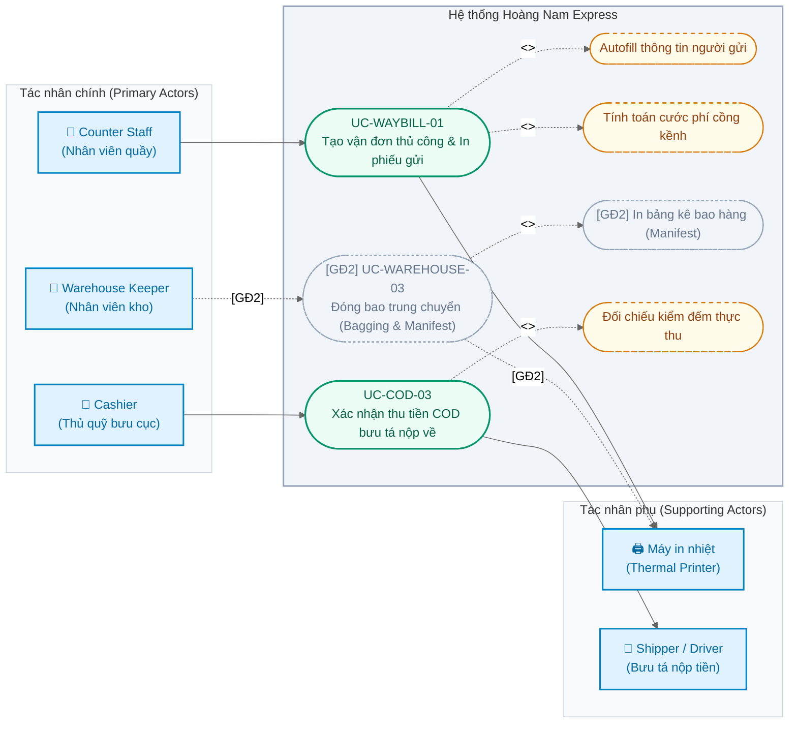

# Use Case Specifications
**Dự án**: Hệ thống Quản lý Chuyển phát nhanh Hoàng Nam (Hoàng Nam Express) — Giai đoạn 1  
**Phiên bản**: 1.0  
**Ngày**: 2026-07-21  
**Tác giả**: BA Antigravity AI  
**Trạng thái**: Draft / In Review  

Tài liệu này đặc tả chi tiết (Fully Dressed Use Cases) cho các quy trình vận hành phức tạp và quan trọng nhất của hệ thống Hoàng Nam Express:
*   **Giai đoạn 1 (Hiện tại)**:
    1.  **UC-WAYBILL-01 (Tương ứng UC-WEB-19)**: Tạo vận đơn thủ công và In phiếu gửi.
    2.  **UC-COD-03 (Tương ứng UC-WEB-39)**: Thủ quỹ bưu cục xác nhận thu tiền COD bưu tá nộp về.
*   **Giai đoạn 2 (Trì hoãn)**:
    1.  **UC-WAREHOUSE-03 (Tương ứng UC-WEB-30)**: Đóng bao trung chuyển (Bagging & Manifest).

---

## Sơ đồ Tổng Quan Use Case (Use Case Diagram)

Dưới đây là sơ đồ Use Case thể hiện các tác nhân (Actors) và mối quan hệ với các chức năng trong phạm vi Hoàng Nam Express (bao gồm cả các phần được trì hoãn sang Giai đoạn 2):

---

## UC-WAYBILL-01: Tạo Vận Đơn Thủ Công và In Phiếu Gửi

### Thông tin cơ bản
*   **Mã Use Case**: UC-WAYBILL-01
*   **Tên Use Case**: Tạo vận đơn thủ công và In phiếu gửi
*   **Actor chính**: Counter Staff (Nhân viên quầy bưu cục)
*   **Actor phụ**: Máy in nhiệt bưu cục
*   **Mô tả tóm tắt**: Nhân viên quầy nhập thông tin chi tiết về người gửi, người nhận, thông số kiện hàng (khối lượng, thể tích), gói dịch vụ sử dụng và số tiền thu hộ COD. Hệ thống tự động tính cước và sinh mã vận đơn. Nhân viên in phiếu gửi khổ nhiệt (A5/A6) để dán lên kiện hàng.
*   **Trigger**: Nhân viên bấm nút "Tạo Vận Đơn Mới" trên màn hình quản lý vận đơn.
*   **Tần suất thực hiện**: Rất cao (~3,000 lần/ngày trên toàn hệ thống).

### Điều kiện tiền đề (Preconditions)
1.  Nhân viên quầy đã đăng nhập thành công vào Web Portal bưu cục.
2.  Tài khoản nhân viên được cấp quyền tạo vận đơn (`bill:create`).
3.  Danh mục địa giới hành chính tĩnh 3 cấp Việt Nam đã được import đầy đủ lên hệ thống.
4.  Cấu hình bảng giá cước mặc định hoặc bảng giá cước của khách hàng đã tồn tại.

### Điều kiện hậu quả (Postconditions)
*   **Thành công (Success)**:
    1.  Vận đơn được tạo thành công trên hệ thống với mã đơn duy nhất (VD: HN123456789VN) và trạng thái ban đầu là "Đã tiếp nhận tại bưu cục".
    2.  Dữ liệu người gửi/người nhận được khóa cứng dưới dạng **Data Snapshot** trong bảng vận đơn.
    3.  Phiếu gửi (PDF/HTML) chứa đầy đủ barcode/QR code và thông tin thanh toán được hiển thị để in ấn.
*   **Thất bại (Failure)**:
    1.  Không có vận đơn nào được lưu vào database.
    2.  Hiển thị thông báo lỗi cụ thể để nhân viên xử lý thông tin nhập vào.

---

### TIẾN TRÌNH THỰC HIỆN CHÍNH (MAIN FLOW)

| Bước | Actor | Hệ thống |
| :--- | :--- | :--- |
| **1** | Nhân viên quầy nhập số điện thoại người gửi. | Hệ thống kiểm tra số điện thoại trong danh bạ khách hàng. Nếu SĐT đã tồn tại, tự động điền (Autofill) họ tên, địa chỉ chi tiết, khu vực Tỉnh/Huyện/Xã của khách hàng gửi và hiển thị Nhóm khách hàng (ví dụ: Khách shop). |
| **2** | Nhân viên nhập thông tin người nhận (Họ tên, SĐT, Địa chỉ chi tiết) và chọn địa giới hành chính người nhận (Tỉnh/Thành -> Quận/Huyện -> Phường/Xã từ dropdown liên kết). | Hệ thống hỗ trợ tìm kiếm nhanh khu vực hành chính và khóa cấu trúc địa chỉ tương ứng. |
| **3** | Nhân viên nhập thông số hàng hóa: Khối lượng thực tế (kg), kích thước (Dài x Rộng x Cao cm), Giá trị khai báo bảo hiểm (VNĐ) và Số tiền COD thu hộ (VNĐ). | Hệ thống ghi nhận dữ liệu hàng hóa. |
| **4** | Nhân viên chọn Gói dịch vụ chính (Tiêu chuẩn/Hỏa tốc) và chọn hình thức trả cước (Người gửi trả ngay/Người gửi ký nợ/Người nhận trả). | Hệ thống tự động xác định bảng giá áp dụng cho khách hàng gửi (giá riêng của shop hoặc giá mặc định của nhóm khách lẻ). |
| **5** | Nhân viên bấm nút "Tính cước". | Hệ thống kiểm tra khối lượng quy đổi từ kích thước thể tích. Tính cước chính, cước bảo hiểm bưu gửi (nếu có), phụ phí hàng đặc thù (nếu có), cộng thêm tiền COD thu hộ và hiển thị bảng chi tiết tổng cước phí trên màn hình. |
| **6** | Nhân viên xác nhận thông tin cước phí với người gửi và bấm "Tạo Đơn & In". | Hệ thống kiểm tra hợp lệ dữ liệu. Thực hiện lưu thông tin vận đơn vào cơ sở dữ liệu, sinh mã đơn duy nhất, đóng băng dữ liệu địa chỉ gửi nhận (**Data Snapshot**) và trả về mã HTML in nhiệt khổ giấy A6. |
| **7** | Nhân viên bấm nút "In" trên hộp thoại in của trình duyệt. | Máy in nhiệt thực hiện in phiếu gửi. Use case kết thúc. |

---

### TIẾN TRÌNH THAY THẾ (ALTERNATIVE FLOWS)

*   **A1: Khách hàng gửi mới chưa có trong danh mục (tại Bước 1)**
    *   1a. Hệ thống thông báo SĐT người gửi chưa có trong hệ thống.
    *   1b. Nhân viên nhập thủ công họ tên người gửi, địa chỉ chi tiết và chọn địa giới hành chính (Tỉnh/Huyện/Xã).
    *   1c. Hệ thống lưu tạm thông tin khách hàng gửi mới để phục vụ autofill cho các lần tạo đơn sau. Tiếp tục bước 2.

*   **A2: Điều chỉnh thông số hàng hóa sau khi tính cước (tại Bước 5)**
    *   5a. Nhân viên thay đổi cân nặng hoặc dịch vụ gia tăng.
    *   5b. Nhân viên bấm lại nút "Tính cước".
    *   5c. Hệ thống cập nhật tính toán lại bảng cước phí mới. Tiếp tục bước 6.

---

### TIẾN TRÌNH NGOẠI LỆ (EXCEPTION FLOWS)

*   **E1: Lỗi tính cước do không tìm thấy tuyến vận chuyển hoặc cước phí bị âm (tại Bước 5)**
    *   5a. Hệ thống phát hiện cước tính ra bị âm hoặc địa chỉ gửi nhận không nằm trong bảng cước cấu hình.
    *   5b. Hệ thống hiển thị cảnh báo: "Lỗi tính toán cước phí. Vui lòng kiểm tra lại cấu hình bảng giá của khách hàng cho tuyến gửi nhận này hoặc liên hệ Admin".
    *   5c. Hệ thống không cho phép lưu đơn hàng. Nhân viên kiểm tra thông tin hoặc hủy giao dịch.

*   **E2: Trùng mã vận đơn hoặc lỗi lưu DB (tại Bước 6)**
    *   6a. Quá trình lưu đơn vào DB bị ngắt quãng hoặc trùng mã vận đơn do truy cập đồng thời.
    *   6b. Hệ thống tự động rollback transaction database, ghi nhật ký lỗi kỹ thuật.
    *   6c. Hiển thị thông báo: "Lỗi hệ thống khi tạo đơn hàng. Vui lòng thử lại".

---

### CÁC QUY TẮC NGHIỆP VỤ LIÊN QUAN (BUSINESS RULES)
*   **BR-01 (Công thức cước cồng kềnh)**: Khối lượng tính cước = Max (Khối lượng thực tế, Khối lượng quy đổi). Khối lượng quy đổi = `(Dài x Rộng x Cao) / 6000` (đơn vị cm, kg).
*   **BR-02 (Data Snapshot)**: Bảng `bills` lưu trực tiếp các trường: `sender_name`, `sender_phone`, `sender_province`, `sender_district`, `sender_ward`, `sender_address_detail` thay vì liên kết khóa ngoại động để đảm bảo dữ liệu đơn hàng cũ không bị thay đổi khi danh bạ khách hàng cập nhật.
*   **BR-03 (Ràng buộc cước phí DB)**: Tổng cước thực thu = Cước chính + Phí bảo hiểm + Phí phụ thu dịch vụ. Ràng buộc CHECK ở DB bắt buộc tổng này không được âm.

---
---

## UC-COD-03: Thủ Quỹ Xác Nhận Thu Tiền COD Bưu Tá

### Thông tin cơ bản
*   **Mã Use Case**: UC-COD-03
*   **Tên Use Case**: Thủ quỹ bưu cục xác nhận thu tiền COD bưu tá nộp về
*   **Actor chính**: Cashier (Thủ quỹ bưu cục)
*   **Actor phụ**: Shipper / Driver (Bưu tá nộp tiền)
*   **Mô tả tóm tắt**: Cuối ngày giao hàng, bưu tá bàn giao tiền mặt COD thu được của người nhận về bưu cục. Thủ quỹ đối đếm tiền mặt thực tế, đối chiếu với Bảng kê nộp tiền bưu tá đã tạo trên hệ thống. Nếu khớp, thủ quỹ bấm duyệt để ghi nhận dòng tiền mặt vào quỹ két sắt bưu cục.
*   **Trigger**: Bưu tá cùng thủ quỹ đến quầy quỹ bưu cục làm thủ tục nộp tiền cuối ngày.
*   **Tần suất thực hiện**: Hàng ngày (Vào cuối ca làm việc từ 17:00 - 21:00).

### Điều kiện tiền đề (Preconditions)
1.  Thủ quỹ đã đăng nhập hệ thống Web Portal bưu cục.
2.  Được cấp quyền phê duyệt dòng tiền COD (`cod:approve`).
3.  Bưu tá đã tạo thành công "Bảng kê nộp tiền COD" trên tài khoản của mình (trạng thái bảng kê là "Chờ thủ quỹ duyệt").

### Điều kiện hậu quả (Postconditions)
*   **Thành công (Success)**:
    1.  Bảng kê nộp tiền COD của bưu tá chuyển sang trạng thái "Đã duyệt - Hoàn tất đối soát".
    2.  Trạng thái các vận đơn nằm trong bảng kê chuyển từ "Giao thành công - Chờ đối soát COD" sang "Đã đối soát COD nội bộ".
    3.  Số dư tiền mặt két sắt bưu cục tăng tương ứng với số tiền đã duyệt.
    4.  Bưu tá được giải phóng công nợ COD trong ngày.
*   **Thất bại (Failure)**:
    1.  Bảng kê giữ nguyên trạng thái "Chờ thủ quỹ duyệt" hoặc bị chuyển sang "Từ chối - Lệch tiền mặt".
    2.  Trạng thái đơn hàng lẻ không thay đổi, dòng tiền quỹ bưu cục không tăng.

---

### TIẾN TRÌNH THỰC HIỆN CHÍNH (MAIN FLOW)

| Bước | Actor | Hệ thống |
| :--- | :--- | :--- |
| **1** | Bưu tá đọc mã bảng kê nộp tiền (hoặc họ tên bưu tá). Thủ quỹ vào màn hình duyệt COD và tìm kiếm bảng kê tương ứng. | Hệ thống hiển thị chi tiết bảng kê nộp tiền: Tổng số tiền mặt COD khai báo nộp, số lượng đơn hàng liên quan và danh sách chi tiết các mã đơn giao thành công. |
| **2** | Bưu tá bàn giao cọc tiền mặt cho thủ quỹ. | Hệ thống hiển thị giao diện kiểm đếm. |
| **3** | Thủ quỹ kiểm đếm tiền mặt thực tế nhận được từ bưu tá và nhập số tiền thực tế đếm được vào ô "Số tiền mặt thực thu". | Hệ thống tự động đối chiếu số tiền thực tế nhập vào với Số tiền khai báo trên bảng kê và tính toán chênh lệch (Lệch = Thực thu - Khai báo). |
| **4** | Số tiền thực đếm khớp hoàn toàn với bảng kê (Lệch = 0). Thủ quỹ bấm nút "Xác nhận và Duyệt bảng kê". | Hệ thống cập nhật bảng kê sang trạng thái "Đã duyệt - Hoàn tất đối soát". Cập nhật các đơn lẻ liên quan sang "Đã đối soát COD nội bộ". Cộng tiền vào số dư két sắt bưu cục hiện tại. Ghi nhận thời gian và mã tài khoản thủ quỹ duyệt đơn. |
| **5** | Hệ thống hiển thị thông báo duyệt thành công. | Use case kết thúc. |

---

### TIẾN TRÌNH THAY THẾ (ALTERNATIVE FLOWS)

*   **A1: Phát hiện lệch tiền mặt (tại Bước 4)**
    *   4a. Số tiền thực tế thủ quỹ đếm được bị thiếu hoặc thừa so với bảng kê (Lệch ≠ 0).
    *   4b. Thủ quỹ nhập số tiền thực tế và bấm nút "Từ chối duyệt - Yêu cầu đối soát lại".
    *   4c. Hệ thống yêu cầu thủ quỹ nhập lý do từ chối (Ví dụ: "Thiếu 200,000đ so với bảng kê").
    *   4d. Hệ thống chuyển trạng thái bảng kê thành "Từ chối - Lệch tiền mặt", ghi nhận số tiền thực nộp tạm thời, không cộng số dư két sắt bưu cục. Bưu tá phải tự kiểm tra lại hành trình các đơn phát và đối chất.

---

### TIẾN TRÌNH NGOẠI LỆ (EXCEPTION FLOWS)

*   **E1: Bưu tá chưa lập bảng kê nộp tiền trên hệ thống (tại Bước 1)**
    *   1a. Bưu tá chưa lập bảng kê nhưng đã mang tiền mặt đến nộp.
    *   1b. Hệ thống không có bảng kê để thủ quỹ thực hiện duyệt.
    *   1c. Thủ quỹ yêu cầu bưu tá đăng nhập tài khoản tự chọn đơn lập bảng kê trước, hoặc thủ quỹ hỗ trợ tạo hộ bảng kê nộp tiền thay bưu tá trên giao diện Admin. Tiếp tục bước 2.

---

### CÁC QUY TẮC NGHIỆP VỤ LIÊN QUAN (BUSINESS RULES)
*   **BR-06 (Quy tắc khóa két sắt cuối ngày)**: Tất cả bảng kê nộp tiền phát sinh trong ngày của bưu cục phải được duyệt hoặc từ chối xử lý trước 22:00 hàng ngày. Sau thời gian này, hệ thống sẽ khóa chức năng duyệt của ngày hôm đó để chốt số dư két sắt cuối ngày phục vụ báo cáo tài chính về kho tổng.
*   **BR-07 (Trách nhiệm tài chính)**: Bưu tá chịu trách nhiệm đền bù 100% số tiền mặt thiếu hụt so với tổng tiền COD hiển thị trên bảng kê của các đơn hàng đã được cập nhật trạng thái "Giao thành công".

---
---

# GIAI ĐOẠN 2 (DEFERRED USE CASES)

## UC-WAREHOUSE-03: Đóng Bao Trung Chuyển (Bagging & Manifest)

### Thông tin cơ bản
*   **Mã Use Case**: UC-WAREHOUSE-03
*   **Tên Use Case**: Đóng bao trung chuyển (Bagging & Manifest)
*   **Actor chính**: Warehouse Keeper (Nhân viên kho bưu cục)
*   **Actor phụ**: Máy in nhiệt bưu cục
*   **Mô tả tóm tắt**: Nhân viên kho gom nhiều đơn hàng lẻ có chung hướng vận chuyển (ví dụ: cùng đi kho trung chuyển tỉnh Lâm Đồng), quét mã vạch gán tất cả vào một mã bao hàng tải lớn, in bảng kê bao (Manifest) dán ngoài bao tải và quét xuất kho bao hàng đi bưu cục tiếp theo.
*   **Trigger**: Nhân viên kho chọn chức năng "Đóng bao trung chuyển" trên giao diện quản lý kho.
*   **Tần suất thực hiện**: Trung bình (~200 lần/ngày trên toàn hệ thống).

### Điều kiện tiền đề (Preconditions)
1.  Nhân viên kho đã đăng nhập vào Web Portal bưu cục.
2.  Được cấp quyền đóng bao và xuất kho (`warehouse:bagging`, `warehouse:outbound`).
3.  Vận đơn lẻ gán vào bao phải có trạng thái hiện tại là "Đang ở kho bưu cục" của bưu cục thao tác.

### Điều kiện hậu quả (Postconditions)
*   **Thành công (Success)**:
    1.  Mã bao hàng (Bag ID) mới được tạo ở trạng thái "Đang đóng bao".
    2.  Các vận đơn lẻ được liên kết với Bag ID và cập nhật trạng thái lịch sử sang "Đã đóng bao trung chuyển".
    3.  In bảng kê bao hàng (Manifest) chứa đầy đủ thông tin danh sách đơn và tổng cân nặng bao.
*   **Thất bại (Failure)**:
    1.  Bao hàng không được tạo.
    2.  Các vận đơn lẻ giữ nguyên trạng thái độc lập ở kho bưu cục.

---

### TIẾN TRÌNH THỰC HIỆN CHÍNH (MAIN FLOW)

| Bước | Actor | Hệ thống |
| :--- | :--- | :--- |
| **1** | Nhân viên kho bấm nút "Tạo bao hàng mới", chọn Bưu cục/Kho đích chuyển đến (Dropdown list). | Hệ thống sinh mã bao hàng duy nhất (ví dụ: BAG123456VN) ở trạng thái "Đang đóng bao". |
| **2** | Nhân viên đặt con trỏ vào ô quét mã vạch và dùng máy quét quét lần lượt mã của các đơn hàng lẻ bốc xếp vào bao. | Hệ thống nhận dạng mã đơn lẻ, kiểm tra trạng thái đơn hợp lệ (phải đang ở kho bưu cục hiện tại), phát tiếng kêu bíp thành công và thêm đơn lẻ vào lưới danh sách đóng bao trên màn hình. Cập nhật khối lượng tạm tính của bao hàng bằng tổng khối lượng các đơn. |
| **3** | Nhân viên quét xong tất cả các đơn lẻ và bấm nút "Đóng và niêm phong bao hàng". | Hệ thống cập nhật trạng thái bao hàng thành "Đã niêm phong". Chuyển trạng thái tất cả đơn lẻ bên trong bao sang "Đang trung chuyển" và liên kết khóa ngoại với mã bao hàng. Ghi nhận lịch sử luân chuyển của từng đơn. |
| **4** | Nhân viên bấm "In bảng kê bao hàng". | Hệ thống xuất bảng PDF manifest chứa mã vạch bao hàng, tên kho nguồn, kho đích, tổng số lượng đơn, tổng khối lượng và danh sách chi tiết các mã đơn lẻ bên trong. |
| **5** | Nhân viên thực hiện quét xuất kho bao hàng lên chuyến xe trung chuyển. | Hệ thống cập nhật trạng thái bao hàng thành "Đã xuất kho trung chuyển", ghi nhận thời gian và nhân viên xuất kho. Use case kết thúc. |

---

### TIẾN TRÌNH NGOẠI LỆ (EXCEPTION FLOWS)

*   **E1: Quét đơn hàng không hợp lệ (tại Bước 2)**
    *   2a. Nhân viên quét một đơn hàng có trạng thái không phải đang tồn ở kho bưu cục hiện tại (ví dụ: đơn chưa lấy, đơn đã phát thành công).
    *   2b. Hệ thống phát âm thanh cảnh báo lỗi (tít còi dài) và hiển thị thông báo: "Đơn hàng X không có trong kho bưu cục hiện tại hoặc trạng thái không hợp lệ để đóng bao".
    *   2c. Đơn hàng đó không được đưa vào danh sách đóng bao. Nhân viên bỏ đơn đó ra ngoài và quét tiếp đơn khác.

*   **E2: Hủy bỏ bao hàng đang đóng dở (tại Bước 3)**
    *   3a. Nhân viên phát hiện gán nhầm kho đích hoặc xảy ra sự cố cần hủy đóng bao.
    *   3b. Nhân viên bấm nút "Hủy đóng bao".
    *   3c. Hệ thống giải phóng tất cả đơn lẻ đã quét khỏi mã bao hàng hiện tại, xóa bao hàng tạm khỏi bộ nhớ. Trạng thái các đơn lẻ quay lại "Đang ở kho bưu cục".

---

### CÁC QUY TẮC NGHIỆP VỤ LIÊN QUAN (BUSINESS RULES)
*   **BR-04 (Quy tắc bao hàng)**: Một đơn hàng lẻ chỉ được gán cho tối đa 1 bao hàng chưa mở tại cùng một thời điểm.
*   **BR-05 (Tổng khối lượng)**: Tổng khối lượng của bao hàng hiển thị trên bảng kê phải bằng tổng khối lượng tính cước của toàn bộ đơn lẻ cộng với khối lượng vỏ bao tải được cấu hình mặc định (ví dụ: +0.2kg).
