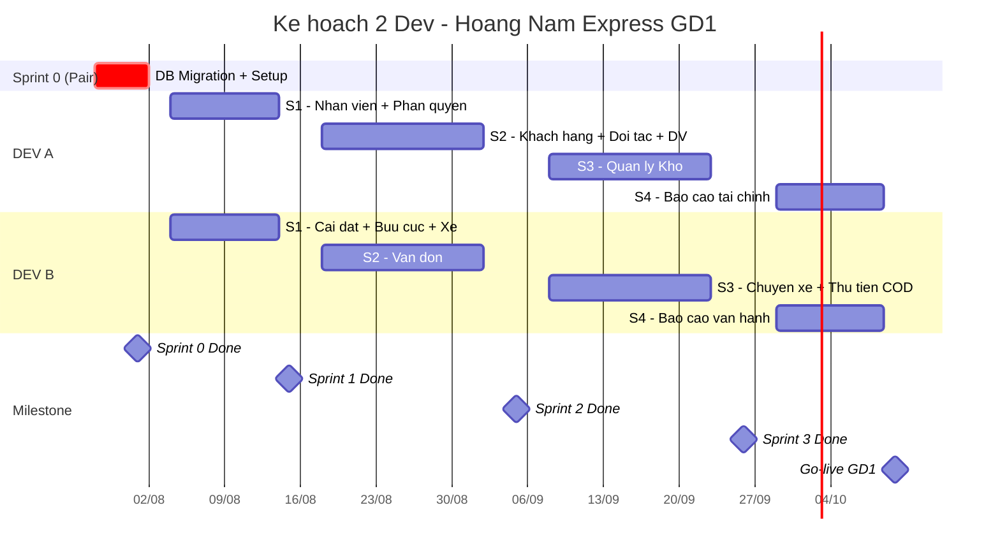

# Kế hoạch Triển khai Phần mềm Hoàng Nam Express — Giai đoạn 1

**Đội ngũ**: 2 Developer (DEV A, DEV B)  
**Thời lượng**: 12 tuần (28/07 → 10/10/2026)

---

## Gantt Chart Tổng quan

---

## Sprint 0 — DB Migration & Setup (1 tuần · Pair)

Cả 2 dev pair programming: refactor DB schema theo `note_db.md`, seed dữ liệu địa giới, thống nhất API convention.

---

## Sprint 1 — Nền tảng Hệ thống (2 tuần)

### DEV A — QUẢN LÝ NHÂN VIÊN

| Mã UC | Chức năng | Mô tả | Ghi chú |
|---|---|---|---|
| UC-WEB-01 | Quản lý phòng ban | Xem, thêm, sửa, xóa phòng ban | Gộp vào UC-WEB-03 |
| UC-WEB-02 | Quản lý chức vụ | Xem, thêm, sửa, xóa chức vụ | Gộp vào UC-WEB-03 |
| UC-WEB-03 | Quản lý nhân viên | Xem, thêm, cập nhật thông tin, phân vai trò tài khoản nhân viên | Bao gồm Phòng Ban, Chức vụ, Phân quyền |

### DEV A — QUẢN LÝ CÀI ĐẶT (phần phân quyền)

| Mã UC | Chức năng | Mô tả |
|---|---|---|
| UC-WEB-10 | Quản lý phân quyền | Tạo nhóm quyền và gán chức năng chi tiết cho từng chức vụ/vai trò |

### DEV B — QUẢN LÝ CÀI ĐẶT (phần địa giới, bưu cục, xe)

| Mã UC | Chức năng | Mô tả | Ghi chú |
|---|---|---|---|
| UC-WEB-04 | Quản lý tỉnh thành | Quản lý danh mục Tỉnh/Thành phố toàn quốc | |
| UC-WEB-05 | Quản lý quận huyện | Quản lý danh mục Quận/Huyện liên kết Tỉnh/Thành | |
| UC-WEB-06 | Quản lý phường xã | Quản lý danh mục Phường/Xã trực thuộc Quận/Huyện | |
| UC-WEB-07 | Quản lý Trung tâm/Chi nhánh/Bưu cục | Xem, thêm, sửa, thiết lập bưu cục giao nhận | |
| UC-WEB-08 | Quản lý khu vực/tuyến giao nhận | Cấu hình khu vực hoạt động, tuyến đường vận chuyển | Gộp vào UC-WEB-07 |
| UC-WEB-09 | Quản lý đội xe | Đăng ký thông tin xe, phân loại xe tải/xe máy | |

---

## Sprint 2 — Nghiệp vụ Chính (3 tuần)

### DEV A — QUẢN LÝ CÀI ĐẶT (phần dịch vụ)

| Mã UC | Chức năng | Mô tả | Ghi chú |
|---|---|---|---|
| UC-WEB-11 | Quản lý dịch vụ/dịch vụ gia tăng | Cấu hình dịch vụ chính (tiêu chuẩn, hỏa tốc) & dịch vụ gia tăng (bảo hiểm, giao tận tay) | Gộp UC-WEB-12 |
| UC-WEB-12 | Quản lý loại hàng hóa | Phân loại nhóm hàng (cồng kềnh, dễ vỡ, tài liệu, chất lỏng) | Gộp vào UC-WEB-11 |

### DEV A — QUẢN LÝ KHÁCH HÀNG

| Mã UC | Chức năng | Mô tả |
|---|---|---|
| UC-WEB-13 | Quản lý thông tin khách hàng | Quản lý danh sách khách hàng gửi, phân loại nhóm khách hàng |
| UC-WEB-14 | Quản lý bảng giá | Thiết lập bảng giá cước chi tiết cho từng khách hàng hoặc nhóm KH |
| UC-WEB-15 | Quản lý công nợ | Kiểm soát công nợ KH gửi định kỳ, lập bảng đối soát, ghi nhận thanh toán |

### DEV A — QUẢN LÝ ĐỐI TÁC

| Mã UC | Chức năng | Mô tả | Ghi chú |
|---|---|---|---|
| UC-WEB-16 | Quản lý thông tin đối tác | Quản lý thông tin đối tác liên kết vận chuyển bên thứ ba (3PL) | |
| UC-WEB-17 | Quản lý bảng giá mua | Quản lý bảng giá cước mua dịch vụ từ đối tác 3PL | Gộp vào UC-WEB-16 |

### DEV B — QUẢN LÝ VẬN ĐƠN

| Mã UC | Chức năng | Mô tả |
|---|---|---|
| UC-WEB-18 | Quản lý lấy hàng | Tiếp nhận yêu cầu gửi hàng, điều phối bưu tá đi lấy hàng |
| UC-WEB-19 | Tạo vận đơn | Nhập thông tin người gửi/nhận, hàng hóa, cước phí để tạo vận đơn mới |
| UC-WEB-23 | Danh sách vận đơn | Bộ lọc tra cứu trạng thái, hành trình chi tiết mọi vận đơn |
| UC-WEB-24 | Hủy giao hàng thành công | Xử lý hủy trạng thái giao thành công khi có khiếu nại hoặc lỗi |
| UC-WEB-26 | Điều chỉnh COD | Cập nhật/điều chỉnh số tiền thu hộ (COD) trước khi xuất kho |
| UC-WEB-27 | Lịch sử điều chỉnh đơn hàng | Truy vết (Audit Log) toàn bộ lịch sử chỉnh sửa vận đơn |

---

## Sprint 3 — Nghiệp vụ Nâng cao (3 tuần)

### DEV A — QUẢN LÝ KHO

| Mã UC | Chức năng | Mô tả |
|---|---|---|
| UC-WEB-28 | Nhập kho | Quét mã vạch nhập kho bưu cục khi nhận hàng từ bưu tá hoặc bưu cục khác |
| UC-WEB-29 | Kiểm điểm kho | Đối soát, kiểm kê số lượng hàng thực tế tồn trong kho bưu cục |
| UC-WEB-30 | Xuất kho trung chuyển | Quét mã vạch xuất hàng trung chuyển đi bưu cục tiếp theo hoặc kho tổng |
| UC-WEB-31 | Xuất hàng đối tác | Quét xuất kho bàn giao hàng cho đối tác vận chuyển 3PL |
| UC-WEB-32 | Xuất kho giao hàng | Quét bàn giao danh sách đơn hàng cho bưu tá đi phát |
| UC-WEB-33 | Xuất kho trả hàng | Thực hiện xuất kho trả hàng hoàn về cho người gửi |
| UC-WEB-34 | Lịch sử xuất/nhập kho | Theo dõi chi tiết lịch sử và thời gian xuất/nhập kho từng đơn |

### DEV B — QUẢN LÝ CHUYỂN XE

| Mã UC | Chức năng | Mô tả |
|---|---|---|
| UC-WEB-35 | Quản lý đội xe | Theo dõi tình trạng hoạt động, lịch trình sử dụng đội xe tải |
| UC-WEB-36 | Quản lý chuyến xe | Tạo chuyến xe, gán tài xế, bốc xếp hàng lên xe và xuất phát hành trình |

### DEV B — QUẢN LÝ THU TIỀN (COD)

| Mã UC | Chức năng | Mô tả |
|---|---|---|
| UC-WEB-37 | Quản lý thu hộ | Theo dõi đối soát tổng dòng tiền thu hộ COD từ đơn phát thành công |
| UC-WEB-38 | Thu tiền nhân viên | Bưu tá nộp tiền COD thu được trong ngày về bưu cục, lập bảng kê thu tiền |
| UC-WEB-39 | Xác nhận thu tiền | Thủ quỹ bưu cục xác nhận đã nhận đủ tiền thực tế từ bưu tá dựa trên bảng kê |

---

## Sprint 4 — Báo cáo Thống kê (2 tuần)

### DEV A + DEV B — BÁO CÁO THỐNG KÊ

| Mã UC | Chức năng | Mô tả | Phân công |
|---|---|---|---|
| UC-WEB-40 | Báo cáo thống kê | Tạo báo cáo doanh thu, sản lượng, công nợ, hiệu suất shipper (tối đa 20 báo cáo) | DEV A: 10 báo cáo tài chính · DEV B: 10 báo cáo vận hành |
